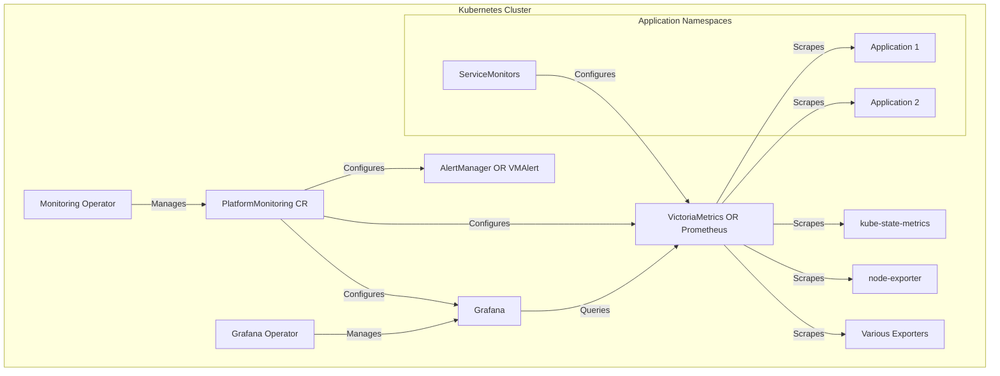
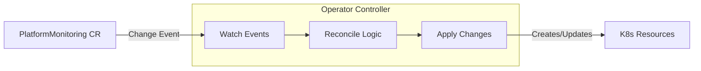
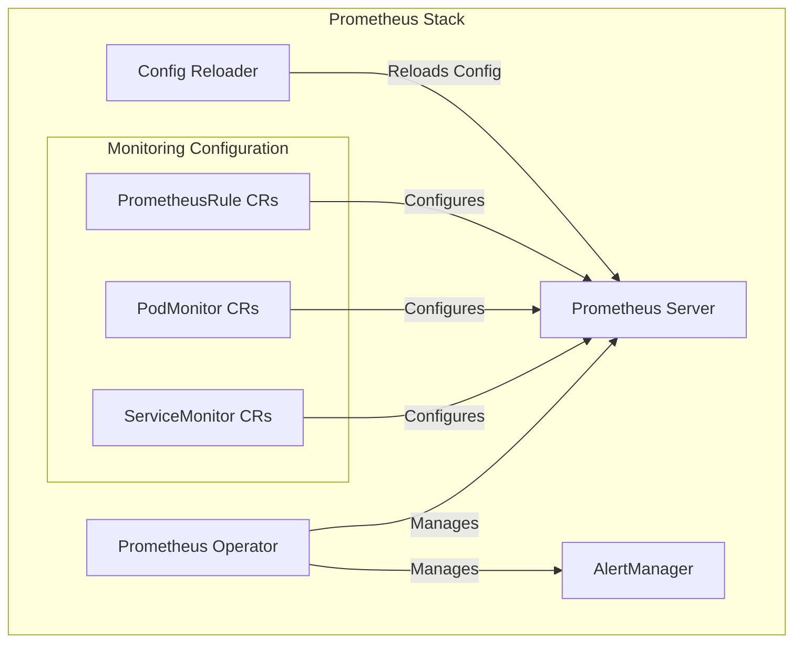
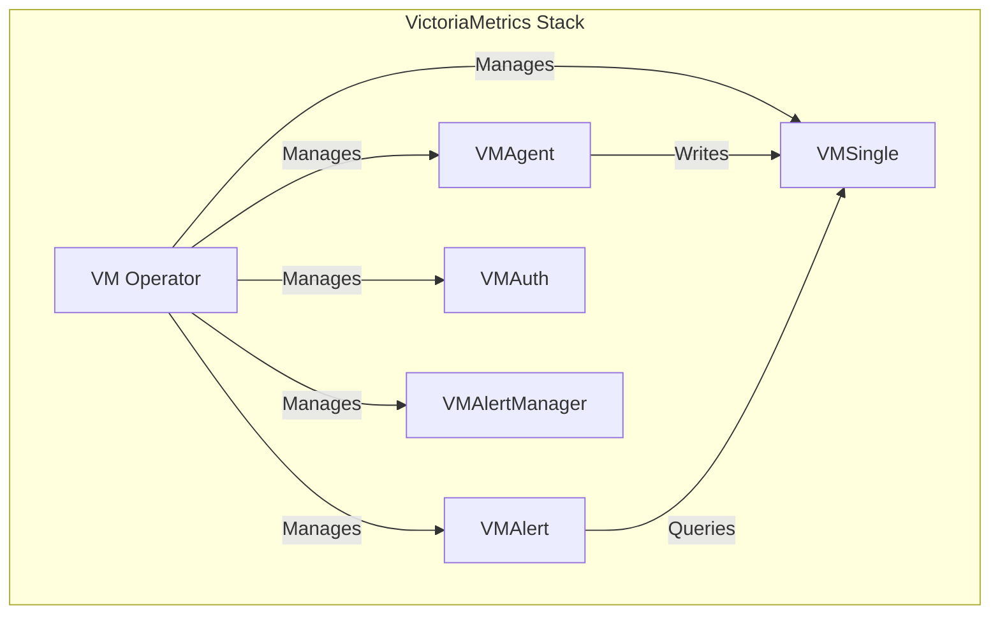
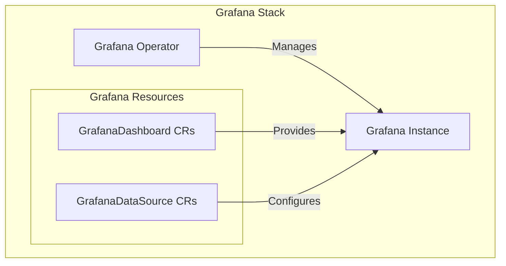
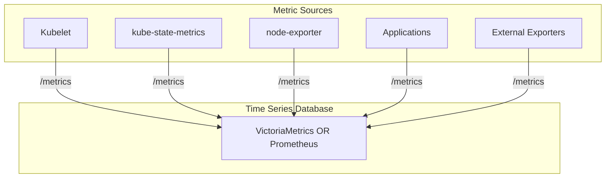
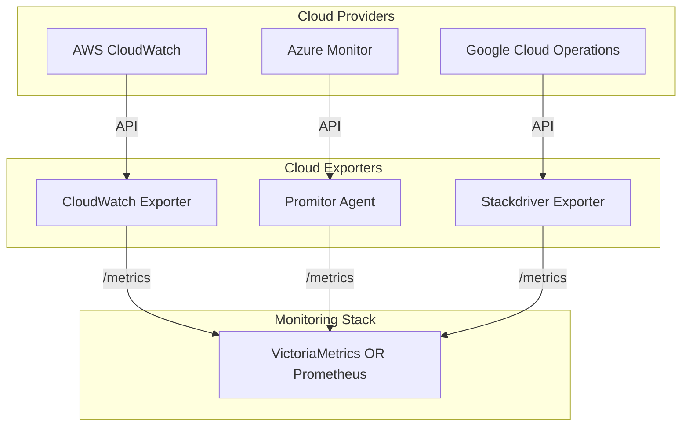
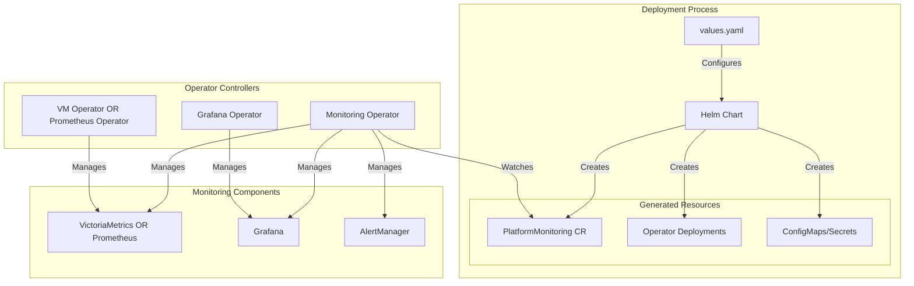
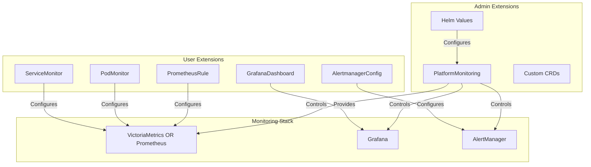
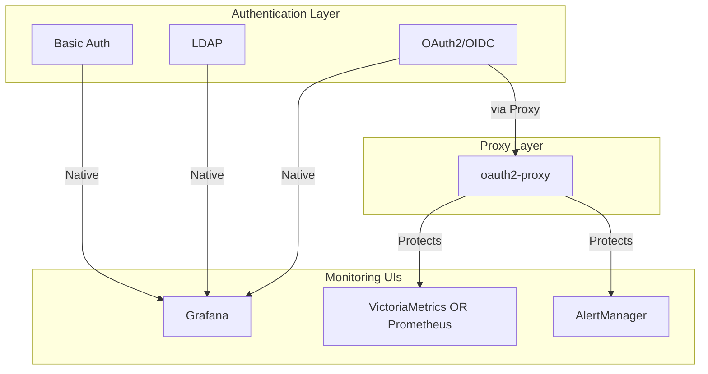

# Architecture

This document describes the detailed architecture of the Qubership Monitoring Operator, a Kubernetes operator that manages the deployment and configuration of a comprehensive monitoring stack. It covers the core components, their relationships, control flows, and integration points.

## Overview

The Qubership Monitoring Operator serves as a centralized controller for managing multiple monitoring components within a Kubernetes environment. It orchestrates the deployment and configuration of Prometheus, VictoriaMetrics, Grafana, AlertManager, and various exporters to create a complete monitoring solution.



## Operator Architecture

The Monitoring Operator is the central component that manages the entire monitoring stack. It watches for and processes a custom resource called `PlatformMonitoring`, which defines the desired state of the monitoring setup.

### Operator Controller Pattern

The operator follows the Kubernetes operator pattern, using the controller-runtime library to watch for changes to the `PlatformMonitoring` resource and reconcile the current state with the desired state.



## Component Architecture

### Time Series Databases

#### Prometheus Stack

The Prometheus stack includes Prometheus itself, AlertManager, and related components. The operator deploys and configures these components using the Prometheus Operator.



The Prometheus Operator handles the deployment and configuration of Prometheus and AlertManager instances. It automatically generates scrape configurations based on ServiceMonitor and PodMonitor custom resources.

#### VictoriaMetrics Integration

VictoriaMetrics can be used as an alternative or complement to Prometheus for storing metrics.



VictoriaMetrics provides a similar but more resource-efficient alternative to Prometheus, with its own set of custom resources for configuration.

### Grafana Stack

The Grafana stack is responsible for visualization of metrics collected by Prometheus or VictoriaMetrics.



The Grafana Operator manages Grafana instances, datasources, and dashboards. It automatically discovers and applies GrafanaDashboard custom resources.

## Custom Resource Architecture

The monitoring system uses various custom resources to configure its components:

### PlatformMonitoring

This is the main custom resource that defines the overall monitoring setup. It's watched by the Monitoring Operator.

```yaml
apiVersion: monitoring.qubership.org/v1alpha1
kind: PlatformMonitoring
metadata:
  name: monitoring-stack
spec:
  prometheus:
    install: true
    retention: "7d"
  grafana:
    install: true
    persistence:
      enabled: true
  victoriametrics:
    vmOperator:
      install: true
```

### ServiceMonitor and PodMonitor

These custom resources define what metrics should be collected by Prometheus or VictoriaMetrics:

```yaml
apiVersion: monitoring.coreos.com/v1
kind: ServiceMonitor
metadata:
  name: example-app
spec:
  selector:
    matchLabels:
      app: example-app
  endpoints:
  - port: metrics
    interval: 30s
```

### PrometheusRule and AlertmanagerConfig

These resources define alerting and recording rules:

```yaml
apiVersion: monitoring.coreos.com/v1
kind: PrometheusRule
metadata:
  name: example-alerts
spec:
  groups:
  - name: example.rules
    rules:
    - alert: HighErrorRate
      expr: rate(http_requests_total{status="500"}[5m]) > 0.1
      for: 5m
      labels:
        severity: warning
      annotations:
        summary: "High error rate detected"
```

## Metrics Collection Architecture

The system collects metrics from various sources:



## Cloud Provider Integration

The system integrates with various cloud providers for metrics collection:



The monitoring operator can deploy specialized exporters for each cloud platform to collect metrics from cloud services and make them available to Prometheus/VictoriaMetrics.

## Deployment Architecture

The system is deployed using Helm charts with a set of configurable values:



The deployment can be customized through various configuration options in the Helm chart's values.yaml file, which controls aspects like storage, authentication, resource limits, and cloud provider integration.

## Extension Architecture

The system can be extended through various custom resources and configuration options:



This architecture allows for flexible extensions by both users (who can add monitoring for their applications) and administrators (who can configure the overall monitoring system).

## Security Architecture

The system includes security features such as authentication for the monitoring components:



The system supports various authentication methods, including OAuth/OIDC, basic auth, and token-based authentication, as well as TLS encryption for secure communications.

## Component Relationships

The following table shows the relationships between different components:

| Component | Managed By | Configures | Provides Data To |
|-----------|------------|------------|------------------|
| Prometheus | Prometheus Operator | ServiceMonitor, PodMonitor | Grafana, AlertManager |
| VictoriaMetrics | VM Operator | VMServiceScrape, VMPodScrape | Grafana, VMAlert |
| Grafana | Grafana Operator | GrafanaDashboard, GrafanaDataSource | Users |
| AlertManager | Prometheus Operator | AlertmanagerConfig | Notification channels |
| kube-state-metrics | Monitoring Operator | Built-in config | Prometheus, VictoriaMetrics |
| node-exporter | Monitoring Operator | Built-in config | Prometheus, VictoriaMetrics |

## Benefits of This Architecture

The Qubership Monitoring Operator architecture provides several key benefits:

1. **Simplified Management**: Automates the deployment and configuration of complex monitoring components
2. **Comprehensive Monitoring**: Collects metrics from various sources including Kubernetes, applications, and cloud providers
3. **Scalability**: Supports both Prometheus and VictoriaMetrics for metrics storage, allowing for scalable monitoring solutions
4. **Visualization**: Integrates with Grafana for metrics visualization and dashboarding
5. **Alerting**: Provides alerting capabilities through AlertManager and VMAlertManager
6. **Cloud Integration**: Supports integration with major cloud providers
7. **Extensibility**: Allows users and administrators to extend functionality through custom resources
8. **Security**: Provides multiple authentication and authorization options

This architecture enables organizations to deploy and maintain a production-ready monitoring stack with minimal operational overhead while providing the flexibility to customize and extend the system as needed. 