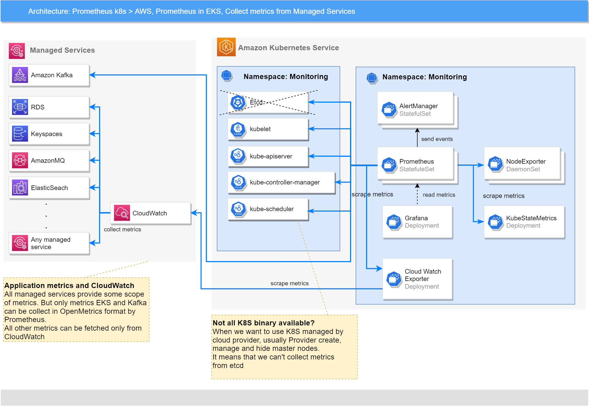

This document provides information about various integration options with AWS monitoring tools
and managed services.

# Table of Content

* [Table of Content](#table-of-content)
* [AWS CloudWatch](#aws-cloudwatch)
  * [Get Metrics from AWS CloudWatch](#get-metrics-from-aws-cloudwatch)
    * [CloudWatch Metrics](#cloudwatch-metrics)
      * [How to Configure CloudWatch Exporter](#how-to-configure-cloudwatch-exporter)
      * [How to Setup Monitoring in CloudWatch](#how-to-setup-monitoring-in-cloudwatch)
      * [How to Setup Metrics Collection from CloudWatch](#how-to-setup-metrics-collection-from-cloudwatch)
        * [Credentials and Permissions](#credentials-and-permissions)
          * [Using an IAM Role (recommended)](#using-an-iam-role-recommended)
          * [Using an IAM User](#using-an-iam-user)
        * [VPC Endpoint Configuration](#vpc-endpoint-configuration)
        * [Deploy cloudwatch-exporter in AWS](#deploy-cloudwatch-exporter-in-aws)
      * [How to Check CloudWatch Integration](#how-to-check-cloudwatch-integration)
  * [Send Metrics in AWS CloudWatch](#send-metrics-in-aws-cloudwatch)
  * [Grafana Dashboards](#grafana-dashboards)
    * [EFS](#efs)
    * [EBS](#ebs)
    * [S3](#s3)
    * [Classic ELB](#classic-elb)
    * [Application ELB](#application-elb)
    * [Network ELB](#network-elb)
    * [RabbitMQ](#rabbitmq)
    * [Cassandra](#cassandra)
* [AWS Managed Prometheus](#aws-managed-prometheus)
  * [Send Metrics to AWS Managed Prometheus](#send-metrics-to-aws-managed-prometheus)
    * [Create Workspace](#create-workspace)
    * [Ingest Prometheus Metrics to the Workspace](#ingest-prometheus-metrics-to-the-workspace)
      * [Set up IAM Roles for Service Accounts](#set-up-iam-roles-for-service-accounts)
      * [Deploy Monitoring and Start Ingesting Metrics](#deploy-monitoring-and-start-ingesting-metrics)
        * [Configure Ingesting Metrics in AWS VPC](#configure-ingesting-metrics-in-aws-vpc)
    * [Send High-Availability Data](#send-high-availability-data)
      * [Configure Monitoring Stack to Send High-Availability Data](#configure-monitoring-stack-to-send-high-availability-data)
  * [Create Recording Rules](#create-recording-rules)
  * [Create Alert Rules](#create-alert-rules)
* [Links](#links)

# AWS CloudWatch

Supported features matrix:

| **Monitoring System**     | **Metrics** | **Dashboards** | **Alerting** | **Autoscaling** |
| ------------------------- | ----------- | -------------- | ------------ | --------------- |
| Amazon CloudWatch         | ✓ Yes       | ✗ No           | ✗ No         | ✗ No            |
| Amazon Managed Prometheus | ✓ Yes       | -              | ✓ Yes        | -               |
| Amazon Managed Grafana    | -           | ✓ Yes          | -            | -               |

**Legend**:

* `Yes` - The feature is supported and implemented.
* `No` - The feature is not supported by the target monitoring system.
* `-` - The feature is not applicable.

Integration between AWS CloudWatch or AWS Managed Prometheus and Monitoring Stack should be
configured **before** deploying Monitoring, and it is required to set the correct deployment parameters to enable
the necessary features.

## Get Metrics from AWS CloudWatch

The following image describes how platform monitoring is integrated with Amazon CloudWatch.



In general, the ability to collect metrics from CloudWatch is provided, which it collects from other AWS Managed Services.
These metrics are collected by Prometheus and can be used for showing metrics and alerting in Grafana and AlertManager.

### CloudWatch Metrics

Integration of platform monitoring with AWS CloudWatch takes place through the CloudWatch Exporter.
For more information, refer to
[https://github.com/prometheus/cloudwatch_exporter](https://github.com/prometheus/cloudwatch_exporter).

#### How to Configure CloudWatch Exporter

To configure the CloudWatch Exporter, choose the managed services which you want to monitor, and then choose
the metrics that can be useful for your purposes from the `monitoring` section of the official documentation
for the managed service.

The following table contains links to some AWS managed services that can be useful to collect metrics.
If the table doesn't contain the required managed service, you can the find the necessary metrics
in the official AWS documentation at [https://docs.aws.amazon.com/](https://docs.aws.amazon.com/).

**Note**: You can get a full list of metrics for your environment and for a specific managed service using
the Amazon CLI command.

```bash
aws cloudwatch list-metrics # should print all metrics and them dimensions for selected environment
aws cloudwatch list-metrics --namespace <namespace> # should print metrics for specified namespace and them dimensions for selected environment
```

For the full list of flags and examples, refer to the
AWS CLI Reference at [https://awscli.amazonaws.com/v2/documentation/api/latest/reference/cloudwatch/list-metrics.html](https://awscli.amazonaws.com/v2/documentation/api/latest/reference/cloudwatch/list-metrics.html).

<!-- markdownlint-disable line-length -->
| Managed Service                             | Namespace           | Metrics list                                                                                                                                                                                                                       |
| ------------------------------------------- | ------------------- | ---------------------------------------------------------------------------------------------------------------------------------------------------------------------------------------------------------------------------------- |
| Application Load Balancers                  | AWS/ApplicationELB  | [https://docs.aws.amazon.com/elasticloadbalancing/latest/application/load-balancer-cloudwatch-metrics.html](https://docs.aws.amazon.com/elasticloadbalancing/latest/application/load-balancer-cloudwatch-metrics.html)             |
| Classic Elastic Load Balancers              | AWS/ELB             | [https://docs.aws.amazon.com/elasticloadbalancing/latest/classic/elb-cloudwatch-metrics.html](https://docs.aws.amazon.com/elasticloadbalancing/latest/classic/elb-cloudwatch-metrics.html)                                         |
| Network Load Balancers                      | AWS/NetworkELB      | [https://docs.aws.amazon.com/elasticloadbalancing/latest/network/load-balancer-cloudwatch-metrics.html](https://docs.aws.amazon.com/elasticloadbalancing/latest/network/load-balancer-cloudwatch-metrics.html)                     |
| Keyspaces                                   | AWS/Cassandra       | [https://docs.aws.amazon.com/keyspaces/latest/devguide/metrics-dimensions.html](https://docs.aws.amazon.com/keyspaces/latest/devguide/metrics-dimensions.html)                                                                     |
| DocumentDB                                  | AWS/DocDB           | [https://docs.aws.amazon.com/documentdb/latest/developerguide/cloud_watch.html](https://docs.aws.amazon.com/documentdb/latest/developerguide/cloud_watch.html)                                                                     |
| DynamoDB: NoSQL Key-Value Database          | AWS/DynamoDB        | [https://docs.aws.amazon.com/amazondynamodb/latest/developerguide/metrics-dimensions.html](https://docs.aws.amazon.com/amazondynamodb/latest/developerguide/metrics-dimensions.html)                                               |
| Elastic Block Storage                       | AWS/EBS             | [https://docs.aws.amazon.com/AWSEC2/latest/UserGuide/using_cloudwatch_ebs.html](https://docs.aws.amazon.com/AWSEC2/latest/UserGuide/using_cloudwatch_ebs.html)                                                                     |
| ElastiCache                                 | AWS/Elasticache     | [https://docs.aws.amazon.com/AmazonElastiCache/latest/red-ug/CacheMetrics.Redis.html](https://docs.aws.amazon.com/AmazonElastiCache/latest/red-ug/CacheMetrics.Redis.html)                                                         |
| Elastic Compute Cloud (EC2)                 | AWS/EC2             | [https://docs.aws.amazon.com/AWSEC2/latest/UserGuide/viewing_metrics_with_cloudwatch.html](https://docs.aws.amazon.com/AWSEC2/latest/UserGuide/viewing_metrics_with_cloudwatch.html)                                               |
| Elastic File System                         | AWS/EFS             | [https://docs.aws.amazon.com/efs/latest/ug/efs-metrics.html](https://docs.aws.amazon.com/efs/latest/ug/efs-metrics.html)                                                                                                           |
| ElasticSearch                               | AWS/ES              | [https://docs.aws.amazon.com/elasticsearch-service/latest/developerguide/es-managedomains-cloudwatchmetrics.html](https://docs.aws.amazon.com/elasticsearch-service/latest/developerguide/es-managedomains-cloudwatchmetrics.html) |
| Kinesis Data Stream                         | AWS/Kinesis         | [https://docs.aws.amazon.com/streams/latest/dev/monitoring-with-cloudwatch.html](https://docs.aws.amazon.com/streams/latest/dev/monitoring-with-cloudwatch.html)                                                                   |
| Network Firewall                            | AWS/NetworkFirewall | [https://docs.aws.amazon.com/network-firewall/latest/developerguide/monitoring-cloudwatch.html](https://docs.aws.amazon.com/network-firewall/latest/developerguide/monitoring-cloudwatch.html)                                     |
| NAT Gateway                                 | AWS/NATGateway      | [https://docs.aws.amazon.com/vpc/latest/userguide/vpc-nat-gateway-cloudwatch.html](https://docs.aws.amazon.com/vpc/latest/userguide/vpc-nat-gateway-cloudwatch.html)                                                               |
| Managed Message Broker Service              | AWS/AmazonMQ        | [https://docs.aws.amazon.com/amazon-mq/latest/developer-guide/security-logging-monitoring-cloudwatch.html](https://docs.aws.amazon.com/amazon-mq/latest/developer-guide/security-logging-monitoring-cloudwatch.html)               |
| Relational Database Service                 | AWS/RDS             | [https://docs.aws.amazon.com/AmazonRDS/latest/UserGuide/monitoring-cloudwatch.html](https://docs.aws.amazon.com/AmazonRDS/latest/UserGuide/monitoring-cloudwatch.html)                                                             |
| Route 53 (health checks)                    | AWS/Route53         | [https://docs.aws.amazon.com/Route53/latest/DeveloperGuide/monitoring-cloudwatch.html](https://docs.aws.amazon.com/Route53/latest/DeveloperGuide/monitoring-cloudwatch.html)                                                       |
| Route53 (hosted zones)                      | AWS/Route53         | [https://docs.aws.amazon.com/Route53/latest/DeveloperGuide/monitoring-hosted-zones-with-cloudwatch.html](https://docs.aws.amazon.com/Route53/latest/DeveloperGuide/monitoring-hosted-zones-with-cloudwatch.html)                   |
| Route53 Resolver (endpoints)                | AWS/Route53Resolver | [https://docs.aws.amazon.com/Route53/latest/DeveloperGuide/monitoring-resolver-with-cloudwatch.html](https://docs.aws.amazon.com/Route53/latest/DeveloperGuide/monitoring-resolver-with-cloudwatch.html)                           |
| Route53 Resolver (DNS Firewall rule groups) | AWS/Route53Resolver | [https://docs.aws.amazon.com/Route53/latest/DeveloperGuide/monitoring-resolver-dns-firewall-with-cloudwatch.html](https://docs.aws.amazon.com/Route53/latest/DeveloperGuide/monitoring-resolver-dns-firewall-with-cloudwatch.html) |
| S3 Object Storage                           | AWS/S3              | [https://docs.aws.amazon.com/AmazonS3/latest/userguide/metrics-dimensions.html](https://docs.aws.amazon.com/AmazonS3/latest/userguide/metrics-dimensions.html)                                                                     |
| Managed Apache Kafka                        | AWS/Kafka           | [https://docs.aws.amazon.com/msk/latest/developerguide/metrics-details.html](https://docs.aws.amazon.com/msk/latest/developerguide/metrics-details.html)                                                                           |
<!-- markdownlint-enable line-length -->

**Note**: For Kafka, Amazon provides the ability to collect OpenMetrics.
For more information, refer to [https://docs.aws.amazon.com/msk/latest/developerguide/open-monitoring.html](https://docs.aws.amazon.com/msk/latest/developerguide/open-monitoring.html).

Examples of cloudwatch-exporter configuration for some managed services:

* `ALB`

    ```yaml
      metrics:
      - aws_namespace: AWS/ApplicationELB
        aws_metric_name: UnHealthyHostCount
        aws_dimensions: [TargetGroup, LoadBalancer]
        aws_statistics: [Maximum]
      - aws_namespace: AWS/ApplicationELB
        aws_metric_name: UnHealthyHostCount
        aws_dimensions: [TargetGroup, LoadBalancer, AvailabilityZone]
        aws_statistics: [Maximum]
      - aws_namespace: AWS/ApplicationELB
        aws_metric_name: ActiveConnectionCount
        aws_dimensions: [TargetGroup, LoadBalancer]
        aws_statistics: [Average]
    ```

* `S3`

    ```yaml
      metrics:
      - aws_namespace: AWS/S3
        aws_metric_name: NumberOfObjects
        aws_dimensions: []
        aws_statistics: [Maximum]
        period_seconds: 86400
      - aws_namespace: AWS/S3
        aws_metric_name: BucketSizeBytes
        aws_dimensions: []
        aws_statistics: [Average]
        period_seconds: 86400
    ```
  
The configuration must contain metrics (with statistics, dimensions, and so on) that you want to see in Prometheus.
The official AWS documentation has information about each metric, the most useful statistics for it, and the possible sets
of dimensions.

**Important**: If a metric has different sets of dimensions, the configuration should contain each variant of the metric
with its own set of dimensions. In other words, the `RequestCount` metric with `TargetGroup` and
`LoadBalancer` dimensions, and the same metric `RequestCount` with only the `LoadBalancer` dimension, are different metrics
that should be placed as two different list items in the configuration. One metric with **two different statistics**
also should be written as **two different list items**.

This configuration in the YAML format should be placed as a value for the `.Values.cloudwatchExporter.config`
parameter. For more information, refer to the
[cloudwatch-exporter](../installation.md#cloudwatch-exporter) configuration section.

Examples of configuration files for cloudwatch-exporter by namespace (these configurations can be used as-is):

* [ApplicationELB](../examples/components/cloudwatch-exporter-config/ApplicationELB.yaml)
* [ELB](../examples/components/cloudwatch-exporter-config/ELB.yaml)
* [NetworkELB](../examples/components/cloudwatch-exporter-config/NetworkELB.yaml)
* [Route53](../examples/components/cloudwatch-exporter-config/Route53.yaml)
* [Route53Resolver](../examples/components/cloudwatch-exporter-config/Route53Resolver.yaml)

#### How to Setup Monitoring in CloudWatch

There are no any specific steps or parameters for deploying monitoring in AWS EKS.

To deploy monitoring in AWS, refer to the [Platform Monitoring Installation Procedure](../installation.md).

#### How to Setup Metrics Collection from CloudWatch

This section describe how to configure metrics collection from AWS CloudWatch and the steps that are to be executed
before the deployment.

##### Credentials and Permissions

CloudWatch Exporter uses the AWS Java SDK. For more information, see
[http://docs.aws.amazon.com/AWSSdkDocsJava/latest/DeveloperGuide/welcome.html](http://docs.aws.amazon.com/AWSSdkDocsJava/latest/DeveloperGuide/welcome.html).
The AWS Java SDK offers a variety of ways to provide credentials. For more information, see
[http://docs.aws.amazon.com/AWSSdkDocsJava/latest/DeveloperGuide/credentials.html](http://docs.aws.amazon.com/AWSSdkDocsJava/latest/DeveloperGuide/credentials.html).
This includes the `AWS_ACCESS_KEY_ID` and `AWS_SECRET_ACCESS_KEY` environment variables.

There are two ways to use cloudwatch-exporter in the EKS cluster: using an IAM role (recommended) or an IAM user.

###### Using an IAM Role (recommended)

You can use an IAM role for Kubernetes service accounts to allow pods in EKS clusters using AWS services without giving
open entry details as AWS access key ID and AWS secret access key.

In general, instructions for configuring roles for service accounts are described in the official documentation in
the _IAM roles for service accounts_ section at
[https://docs.aws.amazon.com/eks/latest/userguide/iam-roles-for-service-accounts.html](https://docs.aws.amazon.com/eks/latest/userguide/iam-roles-for-service-accounts.html).

This section is similar to [Set up IAM Roles for Service Accounts](#set-up-iam-roles-for-service-accounts),
but describes how to create a role for cloudwatch-exporter in a more detailed manner.

To create and use an IAM role for the cloudwatch-exporter service account:

_Step 1._ Make sure that an IAM OIDC provider is connected to the EKS cluster, or create one.
For more information to create an IAM OIDC provider for your cluster, see
[https://docs.aws.amazon.com/eks/latest/userguide/enable-iam-roles-for-service-accounts.html](https://docs.aws.amazon.com/eks/latest/userguide/enable-iam-roles-for-service-accounts.html).

You can also determine whether you have an existing IAM OIDC provider for your cluster using an AWS console:

Navigate to EKS > Clusters > _your cluster_ > Details > if `OpenID Connect provider URL` has a URL, go to the
next step.

_Step 2._ Create _IAM policies_ for cloudwatch-exporter to access CloudWatch.

_Step 2.1._ The `cloudwatch:ListMetrics`, `cloudwatch:GetMetricStatistics`, and `cloudwatch:GetMetricData`
IAM permissions are required, so you can create a policy like the following
(for example, named `CloudWatchExporterMonitoring`):

```json
{
    "Version": "2012-10-17",
    "Statement": [
        {
            "Sid": "VisualEditor0",
            "Effect": "Allow",
            "Action": [
                "cloudwatch:GetMetricData",
                "cloudwatch:GetMetricStatistics",
                "cloudwatch:ListMetrics"
            ],
            "Resource": "*"
        }
    ]
}
```

_Step 2.2._ (**Optional**) The `tag:GetResources` IAM permission is also required to use the aws_tag_select feature.

**Important**: The `tag:GetResources` permission is required to access Resource Groups and Tagging endpoints, like
`tagging.<region>.amazonaws.com`, which doesn't work with VPC. So the aws_tag_select feature does not work with VPC.
For the full list of endpoints available in VPC, refer to the official documentation at
[https://docs.aws.amazon.com/vpc/latest/privatelink/integrated-services-vpce-list.html](https://docs.aws.amazon.com/vpc/latest/privatelink/integrated-services-vpce-list.html).
If required, use the following policy (for example, named `CloudWatchExporterMonitoringTags`):

```json
{
    "Version": "2012-10-17",
    "Statement": [
        {
            "Sid": "VisualEditor0",
            "Effect": "Allow",
            "Action": [
                "tag:GetResources"
            ],
            "Resource": "*"
        }
    ]
}
```

_Step 3._ Create an IAM role for ServiceAccount. For more information, see
[https://docs.aws.amazon.com/eks/latest/userguide/associate-service-account-role.html](https://docs.aws.amazon.com/eks/latest/userguide/associate-service-account-role.html).

_Step 3.1._ To find the AWS account ID, navigate to AWS console > IAM.
You can find the AWS account ID in the AWS account section.

Alternatively, run the following command in the AWS CLI:

```bash
account_id=$(aws sts get-caller-identity --query "Account" --output text)
```

Let us assume that the account ID is placed in the `account_id` variable.

_Step 3.2._ To find the OpenID Connect provider for your EKS cluster, navigate to AWS console > EKS.
You can find the OIDC provider in the Details section. Copy this value without
**https://** prefix (format: `oidc.eks.<region>.amazonaws.com/id/<cluster_id>`).

Alternatively, run the following command in the AWS CLI. Replace `my-cluster` with the name of your cluster:

```bash
oidc_provider=$(aws eks describe-cluster --name my-cluster --region $AWS_REGION --query "cluster.identity.oidc.issuer" --output text | sed -e "s/^https:\/\///")
```

Let us assume that the OpenID Connect provider is placed in the `oidc_provider` variable.

_Step 3.3._ Let us assume that the service account name for cloudwatch-exporter is placed in the `service_account`
variable and namespace for cloudwatch-exporter is placed in the `namespace` variable,
and execute the following commands for the AWS CLI:

```bash
export namespace=<cloudwatch_exporter_namespace>
export service_account=<cloudwatch_exporter_service_account_name>
```

_Step 3.4._ Create an IAM role using the AWS console. Navigate to `IAM > Roles > Create role`.

1. Select `Custom trust policy` and use the following JSON, which replaces all "variables" starting with `$`
   with the corresponding values from the previous steps:

   ```json
   {
       "Version": "2012-10-17",
       "Statement": [
           {
               "Effect": "Allow",
               "Principal": {
                   "Federated": "arn:aws:iam::$account_id:oidc-provider/$oidc_provider"
               },
               "Action": "sts:AssumeRoleWithWebIdentity",
               "Condition": {
                   "StringEquals": {
                       "$oidc_provider:aud": "sts.amazonaws.com",
                       "$oidc_provider:sub": "system:serviceaccount:$namespace:$service_account"
                   }
               }
           }
       ]
   }
   ```

2. Select the policies for cloudwatch-exporter access to CloudWatch created in _Step 2._
   (For example, `CloudWatchExporterMonitoring` and (optional) `CloudWatchExporterMonitoringTags`).
3. Enter a name for the role (for example, `CloudWatchExporterServiceAccount`), a description, check the other details.
   Click `Create role`.

_Step 4._ Deploy monitoring-operator with cloudwatch-exporter and add the following annotation to the created
service account by using the `.Values.cloudwatchExporter.serviceAccount.annotations` parameter or manually:

```yaml
eks.amazonaws.com/role-arn: arn:aws:iam::$account_id:role/$iam_role
```

Example of parameters during the deployment:

```yaml
cloudwatchExporter:
  ...
  serviceAccount:
    annotations:
      eks.amazonaws.com/role-arn: arn:aws:iam::$account_id:role/$iam_role
```

Where, `$account_id` is the AWS account ID (_Step 3.1._) and `$iam_role` is the name of the role created in _Step 3.4._
(for example, `CloudWatchExporterServiceAccount`).

_Step 5._ (**Optional**) In some cases, you may need to configure the AWS Security Token Service endpoint for a
service account. For more information, see
[https://docs.aws.amazon.com/eks/latest/userguide/configure-sts-endpoint.html](https://docs.aws.amazon.com/eks/latest/userguide/configure-sts-endpoint.html).

In general, if the Kubernetes version of your cluster is 1.22 or higher, STS endpoint type should be configured as
`Regional`. Otherwise, the endpoint type should be configured as `Global`.

To use the `Regional` type, add the following annotation to the service account:

```yaml
eks.amazonaws.com/sts-regional-endpoints: true
```

Example of parameters during the deployment:

```yaml
cloudwatchExporter:
  ...
  serviceAccount:
    annotations:
      eks.amazonaws.com/role-arn: arn:aws:iam::$account_id:role/$iam_role
      eks.amazonaws.com/sts-regional-endpoints: true
```

Otherwise, replace `true` with `false`.

###### Using an IAM User

You can use an IAM user to give permissions to cloudwatch-exporter.

Firstly, you should create IAM policies for access to CloudWatch. The `cloudwatch:ListMetrics`,
`cloudwatch:GetMetricStatistics`, and `cloudwatch:GetMetricData` IAM permissions are required.

Role in JSON:

```json
{
    "Version": "2012-10-17",
    "Statement": [
        {
            "Sid": "VisualEditor0",
            "Effect": "Allow",
            "Action": [
                "cloudwatch:GetMetricData",
                "cloudwatch:GetMetricStatistics",
                "cloudwatch:ListMetrics"
            ],
            "Resource": "*"
        }
    ]
}
```

**Important**: The `tag:GetResources` permission is required to access to Resource Groups and Tagging endpoints, like
`tagging.<region>.amazonaws.com`, which doesn't work with VPC. So the aws_tag_select feature does not work with VPC.
For the full list of endpoints available in VPC, see
[https://docs.aws.amazon.com/vpc/latest/privatelink/integrated-services-vpce-list.html](https://docs.aws.amazon.com/vpc/latest/privatelink/integrated-services-vpce-list.html).

The `tag:GetResources` IAM permission is also required to use the `aws_tag_select` feature:

```json
{
    "Version": "2012-10-17",
    "Statement": [
        {
            "Sid": "VisualEditor0",
            "Effect": "Allow",
            "Action": [
                "tag:GetResources"
            ],
            "Resource": "*"
        }
    ]
}
```

IAM permissions can be added directly to a user or you can first create Policies, Groups, and then add the earlier
created group to the user.

To create a user:

1. Open IAM, and select Users.
2. Click `Add Users`.
3. Enter the user name and do not forget to set `Access key - Programmatic access` to generate the access key.
4. Select the earlier created group or permissions.
5. Create the user and save the `Access Key ID` and `Secret Access Key`.

Then manually create a Kubernetes secret with credentials in the namespace for cloudwatch-exporter. The secret
must contain the `aws_access_key_id` field with AWS the access key ID and the `aws_secret_access_key` field
with the Secret access key. In this case, set the name of the created secret in the `.aws.secret.name`
parameter during the deployment.

Otherwise, you can specify the AWS access key ID and Secret access key directly using `.aws.aws_access_key_id` and
`.aws.aws_secret_access_key` parameters during the deployment.

##### VPC Endpoint Configuration

**Important**: This is a very important step if you are using a `Virtual Private Cloud` (VPC)
Without a VPC endpoint for CloudWatch, the exported data cannot get access to its endpoint (non-global, non-regional).

You have to configure a VPC endpoint for CloudWatch if you are using VPC in AWS.

For more information about VPC, see
[https://docs.aws.amazon.com/vpc/latest/userguide/what-is-amazon-vpc.html](https://docs.aws.amazon.com/vpc/latest/userguide/what-is-amazon-vpc.html).

To add a VPC endpoint:

1. Use AWS Console and navigate to `VPC`.
2. Open `Virtual Private Cloud > Endpoints`.
3. Check the `Service Name` column whether `com.amazonaws.<region>.monitoring` already exists.
   If yes, then skip the following steps.
4. Click `Create Endpoint`.
5. Select:

    ```yaml
    Service category: AWS Services
    Service Name: Find and select com.amazonaws.<region>.monitoring
    VPC: Select necessary VPC
    Set another settings
    ```

6. Click `Create Endpoint`.

**Warning**: A typical mistake made when creating a VPC endpoint is the wrong Security Group. You should specify
the group which allows the pod in AWS EKS to get access to the VPC endpoint.

##### Deploy cloudwatch-exporter in AWS

**Important**: Note that `.cloudwatchExporter.config` below contains a very simple example.
You should specify the list of metrics and dimensions that you have to get from CloudWatch.
For the lists of full metrics, refer to [CloudWatch Metrics](#cloudwatch-metrics).

**Note**: Pay attention to the settings that can be specified under the `cloudwatchExporter.config` parameter, such as,

```yaml
cloudwatchExporter:
  serviceMonitor: 
   interval: 2m
  config:
    period_seconds: 120
    delay_seconds: 60
```

These parameters are very important to get the actual metrics from CloudWatch without a delay. The default value of
`delay_seconds` is `600 s`, and this parameter is used to avoid collecting data that has not fully converged.
`600 s` specifies that the exporter fetches data only after `600 s = 10 m`. To decrease the delay, it is recommended
to decrease the value to `60 s`. This time is enough for CloudWatch to collect the metrics and allows
cloudwatch_exporter to fetch them.

Refer to the official documentation of cloudwatch_exporter for full descriptions of all parameters at
[https://github.com/prometheus/cloudwatch_exporter#configuration](https://github.com/prometheus/cloudwatch_exporter#configuration).

To deploy Monitoring with cloudwatch-exporter, the following parameters have to be added in the deployment:

```yaml
cloudwatchExporter:
  install: true
  resources:
    limits:
      cpu: 200m
      memory: 256Mi
    requests:
      cpu: 100m
      memory: 128Mi
  aws:
    aws_access_key_id: <access_key_id>
    aws_secret_access_key: <secret_access_key>
  config: |-
    # This is the default configuration for prometheus-cloudwatch-exporter
    region: us-east-1
    period_seconds: 120
    delay_seconds: 60
    metrics:
    ### PostgreSQL
    - aws_namespace: AWS/RDS
      aws_metric_name: DatabaseConnections
      aws_dimensions: [DBInstanceIdentifier]
      aws_statistics: [Average]
    - aws_namespace: AWS/RDS
      aws_metric_name: DiskQueueDepth
      aws_dimensions: [DBInstanceIdentifier]
      aws_statistics: [Average]
```

#### How to Check CloudWatch Integration

If all settings are specified correctly and all users have correct permissions as a result in Prometheus,
the collected metrics are displayed.

All metrics that Prometheus collects from cloudwatch-exporter has names starting from `aws_`,
nd the name of a metric is constructed as:

```prometheus
aws_<namespace_name>_<metric_name>_<aggregation>
```

For example:

```prometheus
aws_rds_disk_queue_depth_average
aws_kafka_bytes_in_per_sec_average
```

In general, you can just find metrics which start from `aws_` in the Prometheus UI and check that they
exist.

## Send Metrics in AWS CloudWatch

TBD

## Grafana Dashboards

This section describes examples grafana dashboards and cloudwatch-exporter configuration for it.

Services:

* AWS/EFS
* AWS/EBS
* AWS/S3
* AWS/ClassicELB
* AWS/ApplicationELB
* AWS/NetworkELB
* AWS/RabbitMQ
* AWS/Cassandra

**NOTE:** You can include it into `cloudwatch-exporter` configmap in namespace where monitoring-operator installed.

During installation, you can use parameters:

```yaml
cloudwatchExporter:
  install: true
  config: |-
        region: ${CLOUDWATCH_REGION}
        period_seconds: 120
        delay_seconds: 60
        metrics:
          <Put there list of configuration from below examples.>
```

**NOTE:** You can use [those examples](../examples/components/cloudwatch-exporter-config/) with cloudwatch-exporter configuration
which contains all metrics from AWS Cloudwatch for each service.

Read installation guide [cloudwatch-exporter section](../installation.md#cloudwatch-exporter) for details.

### EFS

AWS [EFS dashboard](grafana-dashboards-for-amazon-aws/efs.json) required following Cloudwatch-exporter configuration:

```yaml
region: us-east-1
period_seconds: 120
delay_seconds: 60
metrics:
  ### EFS
  - aws_dimensions: [FileSystemId]
    aws_metric_name: PercentIOLimit
    aws_namespace: AWS/EFS
    aws_statistics: [Average]
  - aws_dimensions: [FileSystemId]
    aws_metric_name: BurstCreditBalance
    aws_namespace: AWS/EFS
    aws_statistics: [Average]
  - aws_dimensions: [FileSystemId]
    aws_metric_name: MeteredIOBytes
    aws_namespace: AWS/EFS
    aws_statistics: [Sum]
  - aws_dimensions: [FileSystemId]
    aws_metric_name: TotalIOBytes
    aws_namespace: AWS/EFS
    aws_statistics: [Sum]
  - aws_dimensions: [FileSystemId]
    aws_metric_name: DataReadIOBytes
    aws_namespace: AWS/EFS
    aws_statistics: [Sum]
  - aws_dimensions: [FileSystemId]
    aws_metric_name: DataWriteIOBytes
    aws_namespace: AWS/EFS
    aws_statistics: [Sum]
  - aws_dimensions: [FileSystemId]
    aws_metric_name: MetadataIOBytes
    aws_namespace: AWS/EFS
    aws_statistics: [Sum]
  - aws_dimensions: [FileSystemId]
    aws_metric_name: ClientConnections
    aws_namespace: AWS/EFS
    aws_statistics: [Sum]
  - aws_dimensions: [FileSystemId, StorageClass]
    aws_metric_name: StorageBytes
    aws_namespace: AWS/EFS
    aws_statistics: [Average]
```

### EBS

AWS [EBS dashboard](grafana-dashboards-for-amazon-aws/ebs.json) required following Cloudwatch-exporter configuration:

```yaml
region: us-east-1
period_seconds: 120
delay_seconds: 60
metrics:
  ### EBS
  - aws_dimensions: [VolumeId]
    aws_metric_name: VolumeReadBytes
    aws_namespace: AWS/EBS
    aws_statistics: [Sum]
  - aws_dimensions: [VolumeId]
    aws_metric_name: VolumeWriteBytes
    aws_namespace: AWS/EBS
    aws_statistics: [Sum]
  - aws_dimensions: [VolumeId]
    aws_metric_name: VolumeReadOps
    aws_namespace: AWS/EBS
    aws_statistics: [Sum]
  - aws_dimensions: [VolumeId]
    aws_metric_name: VolumeWriteOps
    aws_namespace: AWS/EBS
    aws_statistics: [Sum]
  - aws_dimensions: [VolumeId]
    aws_metric_name: VolumeTotalReadTime
    aws_namespace: AWS/EBS
    aws_statistics: [Sum]
  - aws_dimensions: [VolumeId]
    aws_metric_name: VolumeTotalWriteTime
    aws_namespace: AWS/EBS
    aws_statistics: [Sum]
  - aws_dimensions: [VolumeId]
    aws_metric_name: BurstBalance
    aws_namespace: AWS/EBS
    aws_statistics: [Average]
```

### S3

AWS [S3 dashboard](grafana-dashboards-for-amazon-aws/s3.json) required following Cloudwatch-exporter configuration:

```yaml
region: us-east-1
period_seconds: 120
delay_seconds: 60
metrics:
  ### S3
  - aws_dimensions: [StorageType, BucketName]
    aws_metric_name: BucketSizeBytes
    aws_namespace: AWS/S3
    aws_statistics: [Average]
  - aws_dimensions: [StorageType, BucketName]
    aws_metric_name: NumberOfObjects
    aws_namespace: AWS/S3
    aws_statistics: [Average]
```

### Classic ELB

AWS [classic ELB dashboard](grafana-dashboards-for-amazon-aws/classic-elb.json) required following Cloudwatch-exporter
configuration:

```yaml
region: us-east-1
period_seconds: 120
delay_seconds: 60
metrics:
  ### Classic ELB
  - aws_dimensions: [AvailabilityZone, LoadBalancer]
    aws_metric_name: HealthyHostCount
    aws_namespace: AWS/ELB
    aws_statistics: [Maximum]
  - aws_dimensions: [AvailabilityZone, LoadBalancer]
    aws_metric_name: UnHealthyHostCount
    aws_namespace: AWS/ELB
    aws_statistics: [Minimum]
  - aws_dimensions: [AvailabilityZone, LoadBalancer]
    aws_metric_name: Latency
    aws_namespace: AWS/ELB
    aws_statistics: [Sum]
  - aws_dimensions: [AvailabilityZone, LoadBalancer]
    aws_metric_name: RequestCount
    aws_namespace: AWS/ELB
    aws_statistics: [Sum]
  - aws_dimensions: [AvailabilityZone, LoadBalancer]
    aws_metric_name: HTTPCode_ELB_4XX
    aws_namespace: AWS/ELB
    aws_statistics: [Sum]
  - aws_dimensions: [AvailabilityZone, LoadBalancer]
    aws_metric_name: HTTPCode_ELB_5XX
    aws_namespace: AWS/ELB
    aws_statistics: [Sum]
  - aws_dimensions: [AvailabilityZone, LoadBalancer]
    aws_metric_name: BackendConnectionErrors
    aws_namespace: AWS/ELB
    aws_statistics: [Sum]
  - aws_dimensions: [AvailabilityZone, LoadBalancer]
    aws_metric_name: SpilloverCount
    aws_namespace: AWS/ELB
    aws_statistics: [Sum]
```

### Application ELB

AWS [application ELB dashboard](grafana-dashboards-for-amazon-aws/application-elb.json) required following
Cloudwatch-exporter configuration:

```yaml
region: us-east-1
period_seconds: 120
delay_seconds: 60
metrics:
  ### Application ELB
  - aws_namespace: AWS/ApplicationELB
    aws_metric_name: ActiveConnectionCount
    aws_dimensions: [AvailabilityZone, LoadBalancer]
    aws_statistics: [Sum]
  - aws_namespace: AWS/ApplicationELB
    aws_metric_name: ConsumedLCUs
    aws_dimensions: [LoadBalancer]
    aws_statistics: [Sum]
  - aws_namespace: AWS/ApplicationELB
    aws_metric_name: HTTPCode_ELB_4XX_Count
    aws_dimensions: [AvailabilityZone, LoadBalancer]
    aws_statistics: [Sum]
  - aws_namespace: AWS/ApplicationELB
    aws_metric_name: HTTPCode_ELB_5XX_Count
    aws_dimensions: [AvailabilityZone, LoadBalancer]
    aws_statistics: [Sum]
  - aws_namespace: AWS/ApplicationELB
    aws_metric_name: ProcessedBytes
    aws_dimensions: [AvailabilityZone, LoadBalancer]
    aws_statistics: [Sum]
  - aws_namespace: AWS/ApplicationELB
    aws_metric_name: RequestCount
    aws_dimensions: [TargetGroup, LoadBalancer, AvailabilityZone]
    aws_statistics: [Sum]
  - aws_namespace: AWS/ApplicationELB
    aws_metric_name: RejectedConnectionCount
    aws_dimensions: [AvailabilityZone, LoadBalancer]
    aws_statistics: [Sum]
  - aws_namespace: AWS/ApplicationELB
    aws_metric_name: HealthyHostCount
    aws_dimensions: [TargetGroup, LoadBalancer, AvailabilityZone]
    aws_statistics: [Minimum]
  - aws_namespace: AWS/ApplicationELB
    aws_metric_name: UnHealthyHostCount
    aws_dimensions: [TargetGroup, LoadBalancer, AvailabilityZone]
    aws_statistics: [Maximum]
  - aws_namespace: AWS/ApplicationELB
    aws_metric_name: ELBAuthSuccess
    aws_dimensions: [AvailabilityZone, LoadBalancer]
    aws_statistics: [Sum]
  - aws_namespace: AWS/ApplicationELB
    aws_metric_name: ELBAuthLatency
    aws_dimensions: [AvailabilityZone, LoadBalancer]
    aws_statistics: [Sum]
  - aws_namespace: AWS/ApplicationELB
    aws_metric_name: ELBAuthError
    aws_dimensions: [AvailabilityZone, LoadBalancer]
    aws_statistics: [Sum]
  - aws_namespace: AWS/ApplicationELB
    aws_metric_name: ELBAuthFailure
    aws_dimensions: [AvailabilityZone, LoadBalancer]
    aws_statistics: [Sum]
```

### Network ELB

AWS [network ELB dashboard](grafana-dashboards-for-amazon-aws/network-elb.json) required following Cloudwatch-exporter
configuration:

```yaml
region: us-east-1
period_seconds: 120
delay_seconds: 60
metrics:
  ### NetworkELB
  - aws_dimensions: [AvailabilityZone, LoadBalancer]
    aws_metric_name: ActiveFlowCount
    aws_namespace: AWS/NetworkELB
    aws_statistics: [Average]
  - aws_dimensions: [AvailabilityZone, LoadBalancer]
    aws_metric_name: ActiveFlowCount_TCP
    aws_namespace: AWS/NetworkELB
    aws_statistics: [Average]
  - aws_dimensions: [AvailabilityZone, LoadBalancer]
    aws_metric_name: ActiveFlowCount_TLS
    aws_namespace: AWS/NetworkELB
    aws_statistics: [Average]
  - aws_dimensions: [AvailabilityZone, LoadBalancer]
    aws_metric_name: ActiveFlowCount_UDP
    aws_namespace: AWS/NetworkELB
    aws_statistics: [Average]
  - aws_dimensions: [LoadBalancer]
    aws_metric_name: ConsumedLCUs
    aws_namespace: AWS/NetworkELB
    aws_statistics: [Average]
  - aws_dimensions: [LoadBalancer]
    aws_metric_name: ConsumedLCUs_TCP
    aws_namespace: AWS/NetworkELB
    aws_statistics: [Average]
  - aws_dimensions: [LoadBalancer]
    aws_metric_name: ConsumedLCUs_TLS
    aws_namespace: AWS/NetworkELB
    aws_statistics: [Average]
  - aws_dimensions: [LoadBalancer]
    aws_metric_name: ConsumedLCUs_UDP
    aws_namespace: AWS/NetworkELB
    aws_statistics: [Average]
  - aws_dimensions: [AvailabilityZone, LoadBalancer, TargetGroup]
    aws_metric_name: HealthyHostCount
    aws_namespace: AWS/NetworkELB
    aws_statistics: [Minimum]
  - aws_dimensions: [AvailabilityZone, LoadBalancer]
    aws_metric_name: ProcessedBytes
    aws_namespace: AWS/NetworkELB
    aws_statistics: [Sum]
  - aws_dimensions: [AvailabilityZone, LoadBalancer]
    aws_metric_name: ProcessedBytes_TCP
    aws_namespace: AWS/NetworkELB
    aws_statistics: [Sum]
  - aws_dimensions: [AvailabilityZone, LoadBalancer]
    aws_metric_name: ProcessedBytes_TLS
    aws_namespace: AWS/NetworkELB
    aws_statistics: [Sum]
  - aws_dimensions: [AvailabilityZone, LoadBalancer]
    aws_metric_name: ProcessedBytes_UDP
    aws_namespace: AWS/NetworkELB
    aws_statistics: [Sum]
  - aws_dimensions: [AvailabilityZone, LoadBalancer]
    aws_metric_name: ProcessedPackets
    aws_namespace: AWS/NetworkELB
    aws_statistics: [Sum]
  - aws_dimensions: [AvailabilityZone, LoadBalancer, TargetGroup]
    aws_metric_name: UnHealthyHostCount
    aws_namespace: AWS/NetworkELB
    aws_statistics: [Maximum]
  - aws_dimensions: [AvailabilityZone, LoadBalancer]
    aws_metric_name: PeakPacketsPerSecond
    aws_namespace: AWS/NetworkELB
    aws_statistics: [Maximum]
```

### RabbitMQ

AWS [RabbitMQ dashboard](grafana-dashboards-for-amazon-aws/rabbitmq.json) required following Cloudwatch-exporter
configuration:

```yaml
region: us-east-1
period_seconds: 120
delay_seconds: 60
metrics:
  ### RabbitMQ
  - aws_dimensions: [Broker]
    aws_metric_name: ExchangeCount
    aws_namespace: AWS/AmazonMQ
    aws_statistics: [Average]
  - aws_dimensions: [Broker]
    aws_metric_name: QueueCount
    aws_namespace: AWS/AmazonMQ
    aws_statistics: [Average]
  - aws_dimensions: [Broker]
    aws_metric_name: ConnectionCount
    aws_namespace: AWS/AmazonMQ
    aws_statistics: [Average]
  - aws_dimensions: [Broker]
    aws_metric_name: ChannelCount
    aws_namespace: AWS/AmazonMQ
    aws_statistics: [Average]
  - aws_dimensions: [Broker]
    aws_metric_name: ConsumerCount
    aws_namespace: AWS/AmazonMQ
    aws_statistics: [Average]
  - aws_dimensions: [Broker]
    aws_metric_name: MessageCount
    aws_namespace: AWS/AmazonMQ
    aws_statistics: [Sum]
  - aws_dimensions: [Broker]
    aws_metric_name: MessageReadyCount
    aws_namespace: AWS/AmazonMQ
    aws_statistics: [Sum]
  - aws_dimensions: [Broker]
    aws_metric_name: MessageUnacknowledgedCount
    aws_namespace: AWS/AmazonMQ
    aws_statistics: [Sum]
  - aws_dimensions: [Broker]
    aws_metric_name: PublishRate
    aws_namespace: AWS/AmazonMQ
    aws_statistics: [Average]
  - aws_dimensions: [Broker]
    aws_metric_name: ConfirmRate
    aws_namespace: AWS/AmazonMQ
    aws_statistics: [Average]
  - aws_dimensions: [Broker]
    aws_metric_name: AckRate
    aws_namespace: AWS/AmazonMQ
    aws_statistics: [Average]
  - aws_dimensions: [Broker]
    aws_metric_name: SystemCpuUtilization
    aws_namespace: AWS/AmazonMQ
    aws_statistics: [Average]
  - aws_dimensions: [Broker]
    aws_metric_name: RabbitMQMemLimit
    aws_namespace: AWS/AmazonMQ
    aws_statistics: [Average]
  - aws_dimensions: [Broker]
    aws_metric_name: RabbitMQMemUsed
    aws_namespace: AWS/AmazonMQ
    aws_statistics: [Average]
  - aws_dimensions: [Broker]
    aws_metric_name: RabbitMQDiskFreeLimit
    aws_namespace: AWS/AmazonMQ
    aws_statistics: [Average]
  - aws_dimensions: [Broker]
    aws_metric_name: RabbitMQDiskFree
    aws_namespace: AWS/AmazonMQ
    aws_statistics: [Average]
  - aws_dimensions: [Broker]
    aws_metric_name: RabbitMQFdUsed
    aws_namespace: AWS/AmazonMQ
    aws_statistics: [Average]
```

### Cassandra

AWS [Cassandra dashboard](grafana-dashboards-for-amazon-aws/cassandra.json) required following Cloudwatch-exporter
configuration:

```yaml
region: us-east-1
period_seconds: 120
delay_seconds: 60
metrics:
  ### Cassandra
  - aws_dimensions: []
    aws_metric_name: AccountMaxTableLevelReads
    aws_namespace: AWS/Cassandra
    aws_statistics: [Maximum]
  - aws_dimensions: []
    aws_metric_name: AccountMaxTableLevelWrites
    aws_namespace: AWS/Cassandra
    aws_statistics: [Maximum]
  - aws_dimensions: []
    aws_metric_name: AccountProvisionedReadCapacityUtilization
    aws_namespace: AWS/Cassandra
    aws_statistics: [Average]
  - aws_dimensions: []
    aws_metric_name: AccountProvisionedWriteCapacityUtilization
    aws_namespace: AWS/Cassandra
    aws_statistics: [Average]
  - aws_dimensions: [Keyspace, TableName]
    aws_metric_name: BillableTableSizeInBytes
    aws_namespace: AWS/Cassandra
    aws_statistics: [Average]
  - aws_dimensions: [Keyspace, Operation, TableName]
    aws_metric_name: ReadThrottleEvents
    aws_namespace: AWS/Cassandra
    aws_statistics: [SampleCount]
  - aws_dimensions: [Keyspace, Operation, TableName]
    aws_metric_name: SuccessfulRequestCount
    aws_namespace: AWS/Cassandra
    aws_statistics: [SampleCount]
  - aws_dimensions: [Operation]
    aws_metric_name: SuccessfulRequestCount
    aws_namespace: AWS/Cassandra
    aws_statistics: [SampleCount]
  - aws_dimensions: [Keyspace, Operation]
    aws_metric_name: SuccessfulRequestCount
    aws_namespace: AWS/Cassandra
    aws_statistics: [SampleCount]
  - aws_dimensions: [Keyspace, Operation, TableName]
    aws_metric_name: SuccessfulRequestLatency
    aws_namespace: AWS/Cassandra
    aws_statistics: [Sum]
  - aws_dimensions: [Operation]
    aws_metric_name: SuccessfulRequestLatency
    aws_namespace: AWS/Cassandra
    aws_statistics: [Sum]
  - aws_dimensions: [Keyspace, Operation]
    aws_metric_name: SuccessfulRequestLatency
    aws_namespace: AWS/Cassandra
    aws_statistics: [Sum]
  - aws_dimensions: [Keyspace, Operation, TableName]
    aws_metric_name: SystemErrors
    aws_namespace: AWS/Cassandra
    aws_statistics: [SampleCount]
  - aws_dimensions: [Keyspace, Operation, TableName]
    aws_metric_name: UserErrors
    aws_namespace: AWS/Cassandra
    aws_statistics: [SampleCount]
  - aws_dimensions: [Keyspace, Operation, TableName]
    aws_metric_name: WriteThrottleEvents
    aws_namespace: AWS/Cassandra
    aws_statistics: [SampleCount]
```

# AWS Managed Prometheus

Amazon Managed Service for Prometheus is a serverless, Prometheus-compatible monitoring
service for container metrics that makes it easier to securely monitor container environments
at scale. With Amazon Managed Service for Prometheus, you can use the same open-source
Prometheus data model and query language that you use today to monitor the performance
of your containerized workloads, and also enjoy improved scalability, availability,
and security without having to manage the underlying infrastructure.

Amazon Managed Service for Prometheus automatically scales the ingestion, storage, and querying
of operational metrics as workloads scale up and down. It integrates with AWS security services
to enable fast and secure access to data.

Amazon Managed Service for Prometheus is designed to be highly available using
multiple Availability Zone (Multi-AZ) deployments. Data ingested into a workspace is replicated
across three Availability Zones in the same region.

Amazon Managed Service for Prometheus works with container clusters that run
on Amazon Elastic Kubernetes Service and self-managed Kubernetes environments.

With Amazon Managed Service for Prometheus, you use the same open-source Prometheus data model
and PromQL query language that you use with Prometheus. Engineering teams can use PromQL to filter,
aggregate, and alarm on metrics and quickly gain performance visibility without any code changes.
Amazon Managed Service for Prometheus provides flexible query capabilities without the operational
cost and complexity.

Metrics ingested into a workspace are stored for 150 days, and are then automatically deleted.

## Send Metrics to AWS Managed Prometheus

**Warning**: The ability for fully automatic installation exists only since version `0.33.0`.
Before this version, you have to manually add the annotation Service Account.

### Create Workspace

A `workspace` is a logical space dedicated to the storage and querying of Prometheus metrics.
A workspace supports fine-grained access control for authorizing its management such as update,
list, describe, and delete, and the ingestion and querying of metrics. You can have one
or more workspaces in each region in your account.

To set up a workspace, implement the following steps.

**To create a workspace using AWS CLI**

1. Enter the following command to create a workspace. This example creates a workspace
   named `my-first-workspace`, but you can use a different alias if you want. Workspace aliases
   are friendly names that help you identify your workspaces. They do not have to be unique.
   Two workspaces could have the same alias, but all workspaces have unique workspace IDs,
   which are generated by Amazon Managed Service for Prometheus.

    ```bash
    aws amp create-workspace [ --alias my-first-workspace]
    ```

    This command returns the following data:

    * `workspaceId` is the unique ID for this workspace. Make a note of this ID.
    * `arn` is the ARN for this workspace.
    * `status` is the current status of the workspace. Immediately after you create the workspace,
       the status will be `CREATING`.

2. If the `create-workspace` command returns a status of `CREATING`, you can then enter
   the following command to find when the workspace is ready. Replace `my-workspace-id` with
   the value that the `create-workspace` command returned for `workspaceId`.

    ```bash
    aws amp describe-workspace --workspace-id my-workspace-id
    ```

   When the `describe-workspace` command returns `ACTIVE` for `status`, the workspace is ready to use.

**To create a workspace using a console**

1. Open the Amazon Managed Service for Prometheus console at
   [https://console.aws.amazon.com/prometheus/](https://console.aws.amazon.com/prometheus/).
2. For Workspace alias, enter an alias for the new workspace.
   Workspace aliases are friendly names that help you identify your workspaces.
   They do not have to be unique. Two workspaces could have the same alias, but all workspaces
   have unique workspace IDs, which are generated by Amazon Managed Service for Prometheus.
3. (Optional) To add tags to the namespace, choose the Add new tag.
   Then, for Key, enter a name for the tag. You can add an optional value for the tag in Value.
   To add another tag, choose Add new tag again.
4. Choose Create workspace.
   The workspace details page is displayed. This displays information including the `status`, `ARN`,
   `workspace ID`, and `endpoint` URLs for this workspace for both remote write and queries.
   Initially, the status is "CREATING". Wait until the status is "ACTIVE", before
   you move to setting up your metric ingestion.
   Make notes of the URLs displayed for the endpoint - remote write URL and Endpoint - query URL.
   They are needed when you configure the Prometheus server to remote write metrics
   to this workspace, and when you query those metrics.

### Ingest Prometheus Metrics to the Workspace

This section explains how to set up the ingestion of metrics into a workspace.

Ingesting metrics is done using Prometheus remote write. Remote write enables the sending
of samples to a remote storage destination. For more information about
remote write configurations, see
[https://prometheus.io/docs/prometheus/latest/configuration/configuration/#remote_write](https://prometheus.io/docs/prometheus/latest/configuration/configuration/#remote_write)
in the Prometheus documentation.

Metrics ingested into a workspace are stored for 150 days, and are then automatically deleted.

#### Set up IAM Roles for Service Accounts

**Warning**: Before creating an IAM role for Kubernetes, do not forget to configure the OIDC provider for EKS. For more information,
see IAM Roles for Service Accounts at
[https://docs.aws.amazon.com/eks/latest/userguide/iam-roles-for-service-accounts.html](https://docs.aws.amazon.com/eks/latest/userguide/iam-roles-for-service-accounts.html)
in the Amazon EKS Security Guide.

For the method of onboarding, use IAM roles
for service accounts in the Amazon EKS cluster where the Prometheus server is running.

With IAM roles for service accounts, you can associate an IAM role with a Kubernetes
service account. This service account can then provide AWS permissions to the containers
in any pod that uses that service account.

For more information, see IAM Roles for Service Accounts in
[https://docs.aws.amazon.com/eks/latest/userguide/iam-roles-for-service-accounts.html](https://docs.aws.amazon.com/eks/latest/userguide/iam-roles-for-service-accounts.html).

If you have not already set up these roles, follow the instructions at Set up service roles
for the ingestion of metrics from Amazon EKS clusters to set up the roles.

The instructions in that section require the use of `eksctl`. For more information, see
Getting started with Amazon Elastic Kubernetes Service – `eksctl`,
[https://docs.aws.amazon.com/eks/latest/userguide/getting-started-eksctl.html](https://docs.aws.amazon.com/eks/latest/userguide/getting-started-eksctl.html).

**Note**: When you are not on EKS or AWS, and are using just access key and secret key to access
Amazon Managed Service for Prometheus, you cannot use the `EKS-IAM-ROLE` based SigV4.

To create an IAM role to ingest metrics from Prometheus servers in Amazon EKS clusters,
follow the instruction in the official documentation at
[https://docs.aws.amazon.com/prometheus/latest/userguide/set-up-irsa.html#set-up-irsa-ingest](https://docs.aws.amazon.com/prometheus/latest/userguide/set-up-irsa.html#set-up-irsa-ingest).

Copy and run the script from the instructions. As a result, an IAM role with the name `amp-iamproxy-ingest-role` is created.
Implement the following steps to get ARN for this role.

**To get an ARN for a role using the AWS CLI**

1. Enter the following command to get the IAM role. This example returns a role.

  ```bash
  aws iam get-role --role-name amp-iamproxy-ingest-role
  ```

  The following data is returned:

  ```json
  {
    "Role": {
        "Description": "amp-iamproxy-ingest-role",
        "AssumeRolePolicyDocument":"<URL-encoded-JSON>",
        "MaxSessionDuration": 3600,
        "RoleId": "AROA1234567890EXAMPLE",
        "CreateDate": "2019-11-13T16:45:56Z",
        "RoleName": "amp-iamproxy-ingest-role",
        "Path": "/",
        "RoleLastUsed": {
            "Region": "us-east-1",
            "LastUsedDate": "2019-11-13T17:14:00Z"
        },
        "Arn": "arn:aws:iam::123456789012:role/amp-iamproxy-ingest-role"
    }
  }
  ```

  The `Arn` field is required for the next procedure.

**To get an ARN for a role using a console**

1. Open the IAM console at
   [https://console.aws.amazon.com/iam/](https://console.aws.amazon.com/iam/).
2. Navigate to Roles. Search and open the IAM role with name `amp-iamproxy-ingest-role`.
3. Search the `ARN` field and keep it for the next procedure.

#### Deploy Monitoring and Start Ingesting Metrics

**Note**: The `.prometheus.serviceAccount` parameter is available only since the `0.33.0` version.

In deployment parameters for Monitoring, specify the following set:

```yaml
## These example applicable as to deploy parameters and for PlatformMonitoring CR

prometheus:
  ...
  serviceAccount:
    annotations: 
      eks.amazonaws.com/role-arn: <IAM_PROXY_PROMETHEUS_ROLE_ARN>
  remoteWrite:
    - url: https://aps-workspaces.<AWS_REGION>.amazonaws.com/workspaces/<WORKSPACE_ID>/api/v1/remote_write
      sigv4:
        region: <AWS_REGION>
      queueConfig:
        maxSamplesPerSend: 1000
        maxShards: 200
        capacity: 2500
  ...
```

Where:

* `IAM_PROXY_PROMETHEUS_ROLE_ARN` is ARN of the `amp-iamproxy-ingest-role` that was created previously.
* `WORKSPACE_ID` is the ID of your Amazon Managed Service for the Prometheus workspace.
* `AWS_REGION` is the region of your Amazon Managed Service for the Prometheus workspace.

Also, all the parameters in `<NAME>` have to be replaced.

Then, just deploy Monitoring.

##### Configure Ingesting Metrics in AWS VPC

If you use Amazon Virtual Private Cloud (Amazon VPC) to host your AWS resources, you can establish a private connection
between your VPC and Amazon Managed Service for Prometheus. You can use these connections to enable
Amazon Managed Service for Prometheus to communicate with your resources on your VPC without going through
the public internet.

For more information about Amazon VPC, see
[https://docs.aws.amazon.com/vpc/latest/userguide/](https://docs.aws.amazon.com/vpc/latest/userguide/).

To use Amazon Managed Service for Prometheus in AWS VPC, create VPC endpoints as follows.

Choose from the following service name endpoints:

* ```bash
  com.amazonaws.<region>.aps-workspaces
  ```

  Choose this service name to work with Prometheus-compatible APIs. For more information, see
  [https://docs.aws.amazon.com/prometheus/latest/userguide/AMP-APIReference.html#AMP-APIReference-Prometheus-Compatible-Apis](https://docs.aws.amazon.com/prometheus/latest/userguide/AMP-APIReference.html#AMP-APIReference-Prometheus-Compatible-Apis).

* ```bash
  com.amazonaws.<region>.aps
  ```

  Choose this service name to perform workspace management tasks. For more information, see
  [https://docs.aws.amazon.com/prometheus/latest/userguide/AMP-APIReference.html#AMP-APIReference-AMPApis](https://docs.aws.amazon.com/prometheus/latest/userguide/AMP-APIReference.html#AMP-APIReference-AMPApis).

For more information about how to create an interface VPC endpoint, see
[https://docs.aws.amazon.com/vpc/latest/privatelink/vpce-interface.html#create-interface-endpoint](https://docs.aws.amazon.com/vpc/latest/privatelink/vpce-interface.html#create-interface-endpoint).

It is not required to change your settings to call another AWS service. If you created an interface VPC endpoint
for Amazon Managed Service for Prometheus, and already have data flowing to the workspaces located on your VPC,
the metrics flows through the interface VPC endpoint by default. Amazon Managed Service for Prometheus uses
public endpoints or private interface endpoints (whichever are in use) to perform this task.

Then add some additional parameters, which are needed to be added to parameters described in the previous topic,
for deploying Monitoring.

Add the following parameters:

* Annotation to specify the need to use regional endpoints.

  ```yaml
  prometheus:
    ...
    serviceAccounts:
      annotations: 
        eks.amazonaws.com/sts-regional-endpoints: true
  ```

* Environment variable into `prometheus` container to specify the need to use regional endpoints.

  ```yaml
  prometheus:
    ...
    containers:
      - name: prometheus
         env:
           - name: AWS_STS_REGIONAL_ENDPOINTS
              value: regional
  ```

  This step is required because currently prometheus-operator doesn't allow to automatically add this variable when
  Service Account has the `eks.amazonaws.com/sts-regional-endpoints: true` annotation. For more information,
  see the issue _EKS deployment of Prom: remote_write using sigv4 defaults to the wrong STS endpoint
  for private VPCs_ at
  [https://github.com/prometheus/prometheus/issues/10308](https://github.com/prometheus/prometheus/issues/10308).

The resulting deployment parameters are:

```yaml
## These example applicable as to deploy parameters and for PlatformMonitoring CR

prometheus:
  ...
  containers:
  - name: prometheus
      env:
        - name: AWS_STS_REGIONAL_ENDPOINTS
          value: regional
  serviceAccounts:
    annotations: 
      eks.amazonaws.com/sts-regional-endpoints: true
      eks.amazonaws.com/role-arn: <IAM_PROXY_PROMETHEUS_ROLE_ARN>
  remoteWrite:
    - url: https://aps-workspaces.<AWS_REGION>.amazonaws.com/workspaces/<WORKSPACE_ID>/api/v1/remote_write
      sigv4:
        region: <AWS_REGION>
      queue_config:
        max_samples_per_send: 1000
        max_shards: 200
        capacity: 2500
  ...
```

### Send High-Availability Data

With `Amazon Managed Service for Prometheus`, use multiple Prometheus instances
as servers in the high-availability mode. This section shows you how to set up Prometheus servers
as collectors with a high-availability configuration. Amazon Managed Service for Prometheus
de-duplicates your metrics and doesn't charge you twice.

When you set up de-duplication, `Amazon Managed Service for Prometheus` makes one Prometheus
instance a leader replica and ingests data samples only from that replica. If the leader replica
stops sending data samples to Amazon Managed Service for Prometheus for 30 seconds,
Amazon Managed Service for Prometheus automatically makes another Prometheus instance
a leader replica and ingests data from the new leader.

**Important**: If you do not set up de-duplication, you are charged for all data samples
that are sent to Amazon Managed Service for Prometheus.
These data samples include duplicate samples.

#### Configure Monitoring Stack to Send High-Availability Data

To set up a high-availability configuration with Prometheus Operator,
apply external labels on all instances of a high-availability group, so that
Amazon Managed Service for Prometheus can identify them. Also, set the
`replicaExternalLabelName` and `externalLabels` parameters for Monitoring deployment.

For example, in the following yaml, `cluster` is added to `externalLabel` to identify a Prometheus
instance agent as part of a high-availability group, and `replicaExternalLabels` identifies
each replica in the group.

**Note**: The parameter `.prometheus.replicaExternalLabelName` is available only since the `0.33.0` version.

```yaml
prometheus:
  ...
  replicaExternalLabelName: __replica__
  externalLabels:
    cluster: prom-dev
  ...
```

<!-- TODO: Add description how to use Grafana with AWS Managed Prometheus -->
<!-- ## Query data from AWS Managed Prometheus -->

## Create Recording Rules

There are no any specific settings for Monitoring. Follow the procedure described in the official documentation at
[https://docs.aws.amazon.com/prometheus/latest/userguide/AMP-Ruler.html](https://docs.aws.amazon.com/prometheus/latest/userguide/AMP-Ruler.html)

## Create Alert Rules

There are no any specific settings for Monitoring. Follow the procedure described in the official documentation at
[https://docs.aws.amazon.com/prometheus/latest/userguide/AMP-alert-manager.html](https://docs.aws.amazon.com/prometheus/latest/userguide/AMP-alert-manager.html)

<!-- TODO: Add description how to use AWS Managed Grafana -->
<!-- # AWS Managed Grafana -->

<!-- ## Upload dashboards into AWS Managed Grafana -->

# Links

* AWS CloudWatch
  * What is Amazon CloudWatch?: [https://docs.aws.amazon.com/AmazonCloudWatch/latest/monitoring/WhatIsCloudWatch.html](https://docs.aws.amazon.com/AmazonCloudWatch/latest/monitoring/WhatIsCloudWatch.html)
  * Using Amazon CloudWatch dashboards: [https://docs.aws.amazon.com/AmazonCloudWatch/latest/monitoring/CloudWatch_Dashboards.html](https://docs.aws.amazon.com/AmazonCloudWatch/latest/monitoring/CloudWatch_Dashboards.html)
  * Using Amazon CloudWatch metrics: [https://docs.aws.amazon.com/AmazonCloudWatch/latest/monitoring/working_with_metrics.html](https://docs.aws.amazon.com/AmazonCloudWatch/latest/monitoring/working_with_metrics.html)
  * Using Amazon CloudWatch alarms: [https://docs.aws.amazon.com/AmazonCloudWatch/latest/monitoring/AlarmThatSendsEmail.html](https://docs.aws.amazon.com/AmazonCloudWatch/latest/monitoring/AlarmThatSendsEmail.html)
  * CloudWatch service quotas: [https://docs.aws.amazon.com/AmazonCloudWatch/latest/monitoring/cloudwatch_limits.html](https://docs.aws.amazon.com/AmazonCloudWatch/latest/monitoring/cloudwatch_limits.html)
* AWS Managed Prometheus
  * What is Amazon Managed Service for Prometheus?: [https://docs.aws.amazon.com/prometheus/latest/userguide/what-is-Amazon-Managed-Service-Prometheus.html](https://docs.aws.amazon.com/prometheus/latest/userguide/what-is-Amazon-Managed-Service-Prometheus.html)
  * Ingest Prometheus metrics to the workspace: [https://docs.aws.amazon.com/prometheus/latest/userguide/AMP-onboard-ingest-metrics.html](https://docs.aws.amazon.com/prometheus/latest/userguide/AMP-onboard-ingest-metrics.html)
  * Query your Prometheus metrics: [https://docs.aws.amazon.com/prometheus/latest/userguide/AMP-onboard-query.html](https://docs.aws.amazon.com/prometheus/latest/userguide/AMP-onboard-query.html)
  * Recording rules and alerting rules: [https://docs.aws.amazon.com/prometheus/latest/userguide/AMP-Ruler.html](https://docs.aws.amazon.com/prometheus/latest/userguide/AMP-Ruler.html)
  * Alert manager and templating: [https://docs.aws.amazon.com/prometheus/latest/userguide/AMP-alert-manager.html](https://docs.aws.amazon.com/prometheus/latest/userguide/AMP-alert-manager.html)
  * Troubleshooting: [https://docs.aws.amazon.com/prometheus/latest/userguide/AMP-troubleshooting.html](https://docs.aws.amazon.com/prometheus/latest/userguide/AMP-troubleshooting.html)
  * Amazon Managed Service for Prometheus service quotas: [https://docs.aws.amazon.com/prometheus/latest/userguide/AMP_quotas.html](https://docs.aws.amazon.com/prometheus/latest/userguide/AMP_quotas.html)
