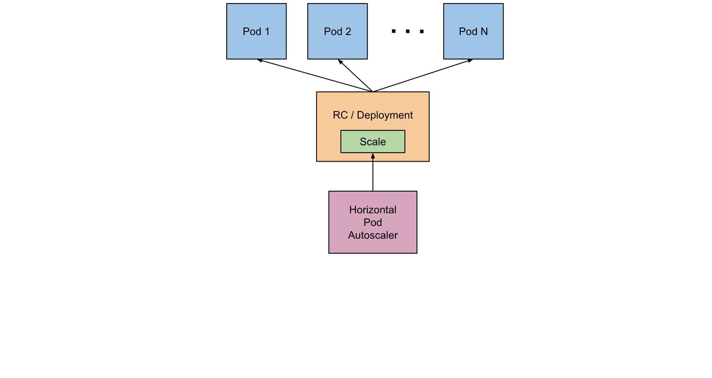

This document describes the abilities and work of integration between Horizontal Pod Autoscaling and Prometheus.

# Table Of Contents

- [Table Of Contents](#table-of-contents)
- [Overview](#overview)
  - [What is HorizontalPodAutoscaler?](#what-is-horizontalpodautoscaler)
  - [How does a HorizontalPodAutoscaler Work?](#how-does-a-horizontalpodautoscaler-work)
  - [Support for Resource Metrics](#support-for-resource-metrics)
    - [Container Resource Metrics](#container-resource-metrics)
  - [Scaling on Custom Metrics](#scaling-on-custom-metrics)
    - [Adapter to Support Custom Metrics in Monitoring](#adapter-to-support-custom-metrics-in-monitoring)
- [Manage Prometheus-adapter for Scale by Custom Metrics](#manage-prometheus-adapter-for-scale-by-custom-metrics)
  - [Before You Begin](#before-you-begin)
    - [Prometheus Adapter and How it can Affect Kubernetes](#prometheus-adapter-and-how-it-can-affect-kubernetes)
      - [Problems with Kubernetes API Server when Adapter is Unavailable](#problems-with-kubernetes-api-server-when-adapter-is-unavailable)
      - [In-built HPA Adapter Does Not Work](#in-built-hpa-adapter-does-not-work)
  - [Installing Prometheus Adapter for Enabling HPA by Custom Metrics](#installing-prometheus-adapter-for-enabling-hpa-by-custom-metrics)
  - [Uninstalling Prometheus Adapter](#uninstalling-prometheus-adapter)
    - [Removing the Object with Kind Prometheus Adapter](#removing-the-object-with-kind-prometheus-adapter)
    - [Removing all Components using Helm](#removing-all-components-using-helm)
- [Using prometheus-adapter](#using-prometheus-adapter)
  - [Declaring New Custom Metrics for Scale](#declaring-new-custom-metrics-for-scale)
    - [How to Read and Write prometheus-adapter Configurations?](#how-to-read-and-write-prometheus-adapter-configurations)
      - [Discovery](#discovery)
      - [Association](#association)
      - [Naming](#naming)
      - [Querying](#querying)
    - [How to Check whether Metrics are Exposed in Metrics API?](#how-to-check-whether-metrics-are-exposed-in-metrics-api)
  - [Writing HorizontalPodAutoscaler for Scale by Custom Metrics](#writing-horizontalpodautoscaler-for-scale-by-custom-metrics)
  - [Resource Metrics](#resource-metrics)
- [Useful Links](#useful-links)

# Overview

This section describes what is a `HorizontalPodAutoscaler` and provides generic details about its working.

## What is HorizontalPodAutoscaler?

In Kubernetes, a `HorizontalPodAutoscaler` (HPA) automatically updates a workload resource (such as `Deployment`
or `StatefulSet`) with the aim of automatically scaling the workload to match demand.

Horizontal scaling specifies that the response to increased load is to deploy more pods. This is different from `vertical`
scaling, which for Kubernetes means assigning more resources (for example, memory or CPU) to the pods that
are already running for the workload.

If the load decreases, and the number of pods is above the configured minimum, the `HorizontalPodAutoscaler` instructs
the workload resource (Deployment, StatefulSet, or other similar resource) to scale back down.

Horizontal pod autoscaling does not apply to objects that cannot be scaled (for example, a DaemonSet).

The `HorizontalPodAutoscaler` is implemented as a Kubernetes API resource and a controller. The resource determines
the behavior of the controller. The horizontal pod autoscaling controller, running within the Kubernetes control plane,
periodically adjusts the desired scale of its target (for example, a Deployment) to match observed metrics such as
the average CPU utilization, average memory utilization, or any other custom metric specified.


[Back to TOC](#table-of-contents)


## How does a HorizontalPodAutoscaler Work?



HorizontalPodAutoscaler controls the scale of a deployment and its ReplicaSet.

Kubernetes implements horizontal pod autoscaling as a control loop that runs intermittently
(it is not a continuous process). The interval is set by the `--horizontal-pod-autoscaler-sync-period` parameter
to the kube-controller-manager and the default interval is `15` seconds. For more information, see [https://kubernetes.io/docs/reference/command-line-tools-reference/kube-controller-manager/](https://kubernetes.io/docs/reference/command-line-tools-reference/kube-controller-manager/).

Once during each period, the controller manager queries the resource utilization against the metrics specified in each
`HorizontalPodAutoscaler (HPA)` definition. The controller manager finds the target resource defined by the `scaleTargetRef`,
then selects the pods based on the target resource's `.spec.selector` labels, and obtains the metrics from either
the resource metrics API (for per-pod resource metrics), or the custom metrics API (for all other metrics).

* For per-pod resource metrics (like CPU), the controller fetches the metrics from the resource metrics API for each pod
  targeted by the `HorizontalPodAutoscaler`. If a target utilization value is set, the controller calculates
  the utilization value as a percentage of the equivalent
  resource request on the containers in each pod. For more information, see [https://kubernetes.io/docs/concepts/configuration/manage-resources-containers/#requests-and-limits](https://kubernetes.io/docs/concepts/configuration/manage-resources-containers/#requests-and-limits).
  
  If a target raw value is set, the raw metric values are used directly. The controller then takes the mean
  of the utilization or the raw value (depending on the type of target specified) across all targeted pods,
  and produces a ratio used to scale the number of desired replicas.

  Note that if some of the pod's containers do not have the relevant resource request set,
  CPU utilization for the pod will not be defined and the autoscaler will not take any action for that metric.
  Refer to the algorithm details section in the official documentation at [https://kubernetes.io/docs/tasks/run-application/horizontal-pod-autoscale/#algorithm-details](https://kubernetes.io/docs/tasks/run-application/horizontal-pod-autoscale/#algorithm-details)
   for more information about how the autoscaling algorithm works.

* For per-pod custom metrics, the controller functions similarly to per-pod resource metrics,
  except that it works with raw values, not utilization values.

* For object metrics and external metrics, a single metric is fetched, which describes the object in question.
  This metric is compared to the target value, to produce a ratio as above. In the `autoscaling/v2` API version,
  this value can optionally be divided by the number of pods before the comparison is made.

The common use for `HorizontalPodAutoscaler` is to configure it to fetch metrics from aggregated APIs
(`metrics.k8s.io`, `custom.metrics.k8s.io`, or `external.metrics.k8s.io`). The metrics.k8s.io API is usually
provided by an add-on named Metrics Server, which needs to be launched separately. For more information about
resource metrics, see
[https://kubernetes.io/docs/tasks/debug/debug-cluster/resource-metrics-pipeline/#metrics-server](https://kubernetes.io/docs/tasks/debug/debug-cluster/resource-metrics-pipeline/#metrics-server).

For explanation about the stability guarantees and support status for these different APIs, see [https://kubernetes.io/docs/tasks/run-application/horizontal-pod-autoscale/#support-for-metrics-apis](https://kubernetes.io/docs/tasks/run-application/horizontal-pod-autoscale/#support-for-metrics-apis).

The HorizontalPodAutoscaler controller accesses the corresponding workload resources that support scaling
(such as Deployments and StatefulSet). These resources each have a subresource named scale, an interface
that allows you to dynamically set the number of replicas and examine each of their current states.
For general information about subresources in the Kubernetes API, see
[https://kubernetes.io/docs/reference/using-api/api-concepts/](https://kubernetes.io/docs/reference/using-api/api-concepts/).


[Back to TOC](#table-of-contents)


## Support for Resource Metrics

Any `HPA` target can be scaled based on the resource usage of the pods in the scaling target.
When defining the pod specification, the resource requests like CPU and memory should be specified.
This is used to determine the resource utilization and used by the HPA controller to scale the target up or down.
To use resource utilization based scaling, specify a metric source like the following:

```yaml
type: Resource
resource:
  name: cpu
  target:
    type: Utilization
    averageUtilization: 60
```

With this metric, the HPA controller keeps the average utilization of the pods in the scaling target at 60%.
Utilization is the ratio between the current usage of resource to the requested resources of the pod.
For more information about how the utilization is calculated and averaged, see
[https://kubernetes.io/docs/tasks/run-application/horizontal-pod-autoscale/#algorithm-details](https://kubernetes.io/docs/tasks/run-application/horizontal-pod-autoscale/#algorithm-details).

**Note**: Since the resource usages of all the containers are summed up, the total pod utilization
may not accurately represent the individual container resource usage. This could lead to situations
where a single container might be running with high usage and the `HPA` does not scale out
because the overall pod usage is still within acceptable limits.


[Back to TOC](#table-of-contents)


### Container Resource Metrics

**FEATURE STATE**: Kubernetes v1.20 [alpha]

The `HorizontalPodAutoscaler` API also supports a container metric source where the `HPA` can track the resource usage
of individual containers across a set of pods to scale the target resource.
This lets you configure scaling thresholds for the containers that matter most in a particular pod.
For example, if you have a web application and a logging sidecar, you can scale based on the resource use
of the web application, ignoring the sidecar container and its resource use.

If you revise the target resource to have a new pod specification with a different set of containers,
you should revise the `HPA` spec if that newly added container should also be used for scaling.
If the specified container in the metric source is not present or only present in a subset of the pods,
then those pods are ignored and the recommendation is recalculated. For more information about the calculation, see
[https://kubernetes.io/docs/tasks/run-application/horizontal-pod-autoscale/#algorithm-details](https://kubernetes.io/docs/tasks/run-application/horizontal-pod-autoscale/#algorithm-details).

To use container resources for autoscaling, define a metric source as follows:

```yaml
type: ContainerResource
containerResource:
  name: cpu
  container: application
  target:
    type: Utilization
    averageUtilization: 60
```

In the above example, the HPA controller scales the target such that the average utilization of the CPU
in the `application` container of all the pods is `60%`.

**Note**: If you change the name of a container that a `HorizontalPodAutoscaler` is tracking, you can make
that change in a specific order to ensure scaling remains available and effective while the change is being applied.
Before you update the resource that defines the container (such as a `Deployment`), you should update the associated
`HPA` to track both the new and old container names. This way, the `HPA` is able to calculate a scaling recommendation
throughout the update process.
Once you have rolled out the container name change to the workload resource, tidy up by removing the old container name
from the `HPA` specification.


[Back to TOC](#table-of-contents)


## Scaling on Custom Metrics

**FEATURE STATE**: Kubernetes v1.23 [stable]

(The autoscaling/v2beta2 API version previously provided this ability as a beta feature)

Provided that you use the autoscaling/v2 API version, you can configure a HorizontalPodAutoscaler to scale based on
a custom metric (that is not built in to Kubernetes or any Kubernetes component).
The HorizontalPodAutoscaler controller then queries for these custom metrics from the Kubernetes API.

For information about the requirements, see
[https://kubernetes.io/docs/tasks/run-application/horizontal-pod-autoscale/#support-for-metrics-apis](https://kubernetes.io/docs/tasks/run-application/horizontal-pod-autoscale/#support-for-metrics-apis).


[Back to TOC](#table-of-contents)


### Adapter to Support Custom Metrics in Monitoring

A special adapter is provided to support scaling by custom metrics by using `HorizontalPodAutoscaler` in Monitoring.
This adapter is called `prometheus-adapter` and it was developed by a community.

The adapter implements the Metric API and allows to use `HorizontalPodAutoscaler` for scale pods replicas by custom
metrics collected by Prometheus (or any other Monitoring supported `PromQL`). For more information, see
[https://kubernetes.io/docs/tasks/debug/debug-cluster/resource-metrics-pipeline/](https://kubernetes.io/docs/tasks/debug/debug-cluster/resource-metrics-pipeline/).


[Back to TOC](#table-of-contents)


# Manage Prometheus-adapter for Scale by Custom Metrics

This section describes how to manage (install, remove, maintain) `prometheus-adapter`.

## Before You Begin

Before deploying `prometheus-adapter`, note the following points:

* `Prometheus-adapter` requires cluster permissions because it registers as a handler
  for Kubernetes `Metrics API`.
* `Prometheus-adapter` pod **MUST** always work to handle all requests from Kubernetes after the deployment.
  If the `prometheus-adapter` is unavailable and cannot handle API requests, it affects some API calls to Kubernetes.
  For more information, refer to the Prometheus Adapter section in the
  [Monitoring Operator Troubleshooting](../troubleshooting.md#prometheus-adapter) chapter.


[Back to TOC](#table-of-contents)


### Prometheus Adapter and How it can Affect Kubernetes

The `prometheus-adapter` is installed for the whole Kubernetes cluster. There are some points to remember
regarding its support. The following section describes some possible issues that can occur during `prometheus-operator`
operations.

#### Problems with Kubernetes API Server when Adapter is Unavailable

The `prometheus-adapter` implements the Kubernetes Metrics API. To handle requests from this API, it must
register as a handler in the Kubernetes API server.

This means that `prometheus-adapter` handles all requests from the **whole** Kubernetes cluster.
Accordingly, problems with it can affect all Kubernetes clusters. So it is extremely important that
`prometheus-adapter` always works and it is better to run it in two replicas.

Fortunately, only one global problem is known currently. It is that namespaces cannot be removed in Kubernetes
if `prometheus-adapter` is not available. Also, some errors in Kubernetes PI server logs can be seen.
Kubernetes does not allow to remove objects (like namespace) that have the `kubernetes` finalizer. For example:

```yaml
apiVersion: v1
kind: Namespace
metadata:
  name: monitoring
spec:
  finalizers:
    - kubernetes   # finalizer which not allow to remove namespace
status:
  phase: Active
```

Other Kubernetes features are not affected.

To fix this issue, refer to the Prometheus Adapter section in the
[Monitoring Operator Troubleshooting](../troubleshooting.md#prometheus-adapter) chapter.


[Back to TOC](#table-of-contents)


#### In-built HPA Adapter Does Not Work

When `prometheus-adapter` is installed in the Kubernetes cluster, it replaces the in-build HPA adapter, which allows
scaling by CPU and memory metrics. So with a third-party, `prometheus-adapter` deployment scaling works only by
custom metrics.

But to avoid this issue and keep the ability to scale by CPU and memory metrics out of the box, a default
configuration is added that exposes some container metrics by default.

The default configuration is specified in two places:

* In ConfigMap which stores aggregated configuration for `prometheus-adapter`
* As `CustomScaleMetricRule` CR

**Note**: During the first installation configuration, it is recommended to write in both places
because with an empty configuration file, `prometheus-adapter` cannot start. So to avoid restarts,
the configuration is added in `CustomScaleMetricRule` CR and ConfigMap.

The default `CustomScaleMetricRule` CR contains the following configuration:

```yaml
apiVersion: monitoring.qubership.org/v1alpha1
kind: CustomScaleMetricRule
metadata:
  name: kubelet-custom-metric-rule
  labels:
    app.kubernetes.io/component: monitoring
spec:
  rules:
  - seriesQuery: '{__name__=~"^container_.*",container!="POD",namespace!="",pod!=""}'
    seriesFilters: [ ]
    name:
      matches: ^container_(.*)_seconds_total$
      as: ""
    resources:
      overrides:
        namespace:
          resource: "namespace"
        pod:
          resource: "pod"
    metricsQuery: sum(rate(<<.Series>>{<<.LabelMatchers>>,container!="POD"}[5m])) by (<<.GroupBy>>)
```

**Warning**: Pay attention that `prometheus-adapter` always should not have an empty configuration.
So if you have other `CustomScaleMetricRule` CRs in the cloud, do not remove this default CR or add any other CR
with the configuration before removing it.


[Back to TOC](#table-of-contents)


## Installing Prometheus Adapter for Enabling HPA by Custom Metrics

To install the Prometheus adapter, use the following parameters (minimal parameters set):

```yaml
prometheusAdapter:
  install: true
  securityContext:
    runAsUser: 2000
    fsGroup: 2000
  resources:
    requests:
      cpu: 500m
      memory: 1Gi
    limits:
      cpu: 1000m
      memory: 2Gi
  operator:
    securityContext:
      runAsUser: 2000
      fsGroup: 2000
    resources:
      requests:
        cpu: 100m
        memory: 100Mi
      limits:
        cpu: 200m
        memory: 200Mi
```

All necessary configurations, Service Accounts, Roles, and so on, are created during the deployment.

Deploy execution uses Helm charts and operator.
First, the Helm chart executes the deployment of `prometheus-adapter-operator` and other configurations for it
(like Roles or Custom Resources).
Then the operator deploys `prometheus-adapter`, all the necessary objects for its working, and configures it.


[Back to TOC](#table-of-contents)


## Uninstalling Prometheus Adapter

To uninstall `prometheus-adapter`, the following options are available. However, some manual steps are also required.

The two options to remove `prometheus-adapter` are:

* Keep `prometheus-adapter-operator` and remove the object with kind PrometheusAdapter.
* Delete all components using Helm and `helm uninstall` command.


[Back to TOC](#table-of-contents)


### Removing the Object with Kind Prometheus Adapter

This method allows you to keep the operator which can recreate `prometheus-adapter` without any redeployments.

To find the `PrometheusAdapter` Custom Resource (CR), use the following command:

```bash
kubectl get -n <monitoring_namespace> prometheusadapters.monitoring.qubership.org
```

You can print it to backup using the command:

```bash
kubectl get -n <monitoring_namespace> prometheusadapters.monitoring.qubership.org <object_name> -o yaml
```

Also, to register `prometheus-adapter` during the deployment, create an `APIService` object. To find already created
`APIService` objects, use the following command:

```bash
kubectl get apiservices
```

**Note**: You can use this command to check the status of the API handler.
For example, the following output shows that APIs for handling autoscaling are now available
and the Kubernetes API Server is operating:

```bash
❯ kubectl get apiservices
NAME                                         SERVICE                         AVAILABLE   AGE
...
v1.autoscaling                               Local                           True        650d
...
v2beta1.autoscaling                          Local                           True        650d
v2beta2.autoscaling                          Local                           True        650d
...
v1beta1.custom.metrics.k8s.io                monitoring/prometheus-adapter   True        19m
```

And the following command helps you to see the details:

```bash
kubectl describe apiservices <API_name>
```

To remove `prometheus-adapter`:

1. Manually remove the registered `APIService`.
2. Remove `PrometheusAdapter` CR.

Execute the following commands to find the registered `APIService` and remove it:

```bash
kubectl get apiservices
kubectl delete v1beta1.custom.metrics.k8s.io
```

Execute the following commands to find and remove the `PrometheusAdapter` CR:

```bash
kubectl get -n <monitoring_namespace> prometheusadapters.monitoring.qubership.org
kubectl delete -n <monitoring_namespace> prometheusadapters.monitoring.qubership.org <object_name>
```

To check that the Kubernetes API Server works fine after removing `prometheus-adapter`, use the following command:

```bash
kubectl get apiservices
```

All services in the `AVAILABLE` column must display `True`.


[Back to TOC](#table-of-contents)


### Removing all Components using Helm

This method allows you to remove all the parts of `prometheus-adapter`, except the registered `APIService`.

To remove the `prometheus-adapter`:

1. Manually remove the registered `APIService`.
2. Remove the Helm chart.

Execute the following commands to find the registered `APIService` and remove it:

```bash
kubectl get apiservices
kubectl delete v1beta1.custom.metrics.k8s.io
```

Execute the following commands to find and remove the `prometheus-adapter` Helm chart:

```bash
helm list -n <monitoring_namespace>
helm uninstall -n <monitoring_namespace> <chart_name>
```


[Back to TOC](#table-of-contents)


# Using prometheus-adapter

This section describes how to use `prometheus-adapter` including the following topics:

* How to expose custom metrics in the Kubernetes Metrics API to use them further?
* How to write the `HorizontalPodAutoscaler` configuration to use custom metrics?

## Declaring New Custom Metrics for Scale

The `prometheus-adapter` allows exposing custom metrics in the Kubernetes Metrics API and use them for scaling.
But by default, it does not automatically expose these metrics.

There are two reasons why the `prometheus-adapter` does not expose all metrics from Prometheus:

* Prometheus can collect a lot of metrics (thousands and even hundreds of thousands of metrics),
  and exposing all metrics can be very expensive for hardware resources.
* It makes no sense to expose all metrics for scaling since nobody uses all the metrics.

To expose custom metrics, specify the metrics in the `prometheus-adapter` configuration. Vanilla third-party
image of `prometheus-adapter` allows to specify the list of metrics to expose only in the configuration file.
But it is not convenient in the case of using Kubernetes with a lot of metrics sources.

So a special Custom Resource (CR) is added with the name `CustomScaleMetricRule`, which allows specifying a part
of the configuration. Thus, the service can expose the metrics and declare which of these metrics can be used to
scale by them.

The `prometheus-adapter-operator` discovers all CRs, collects them, and merges all the parts into one big configuration.

To declare the metrics in the Kubernetes Metrics API, create the `CustomScaleMetricRule` CR.
For example:

```yaml
apiVersion: monitoring.qubership.org/v1alpha1
kind: CustomScaleMetricRule
metadata:
  name: test-service-custom-metric-rule
  labels:
    app.kubernetes.io/component: monitoring   # mandatory label, use during filter all resources
spec:
  rules:
  - seriesQuery: '{__name__=~"prometheus_example_app_load",namespace!="",pod!=""}'
    name:
      matches: "prometheus_example_app_load"
    resources:
      overrides:
        namespace:
          resource: "namespace"
        pod:
          resource: "pod"
    metricsQuery: '<<.Series>>{<<.LabelMatchers>>}'
```


[Back to TOC](#table-of-contents)


### How to Read and Write prometheus-adapter Configurations?

The adapter determines which metrics are to be exposed, and how to expose them, through a set of "discovery" rules.
Each rule is executed independently (so make sure that your rules are mutually exclusive)
and specifies each of the steps the adapter needs to take to expose a metric in the API.

Each rule can be broken down into roughly four parts:

* **Discovery**, which specifies how the adapter should find all Prometheus metrics for this rule.
* **Association**, which specifies how the adapter should determine which Kubernetes resources
  a particular metric is associated with.
* **Naming**, which specifies how the adapter should expose the metric in the custom metrics API.
* **Querying**, which specifies how a request for a particular metric on one or more Kubernetes objects
  should be turned into a query to Prometheus.

```yaml
rules:
# this rule matches cumulative cAdvisor metrics measured in seconds
- seriesQuery: '{__name__=~"^container_.*",container!="POD",namespace!="",pod!=""}'
  resources:
    # skip specifying generic resource<->label mappings, and just
    # attach only pod and namespace resources by mapping label names to group-resources
    overrides:
      namespace:
        resource: "namespace"
      pod:
        resource: "pod"
  # specify that the `container_` and `_seconds_total` suffixes should be removed.
  # this also introduces an implicit filter on metric family names
  name:
    # we use the value of the capture group implicitly as the API name
    # we could also explicitly write `as: "$1"`
    matches: "^container_(.*)_seconds_total$"
  # specify how to construct a query to fetch samples for a given series
  # This is a Go template where the `.Series` and `.LabelMatchers` string values
  # are available, and the delimiters are `<<` and `>>` to avoid conflicts with
  # the prometheus query language
  metricsQuery: "sum(rate(<<.Series>>{<<.LabelMatchers>>,container!="POD"}[2m])) by (<<.GroupBy>>)"
```


[Back to TOC](#table-of-contents)


#### Discovery

Discovery governs the process of finding the metrics that you want to expose in the custom metrics API.
There are two fields that factor into discovery: `seriesQuery` and `seriesFilters`.

`seriesQuery` specifies a Prometheus series query (as passed to the `/api/v1/series` endpoint in Prometheus)
that is used to find a set of a Prometheus series. The adapter strips the label values from this series,
and then uses the resulting metric-name-label-names combinations later on.

In many cases, `seriesQuery` is sufficient to narrow down the list of Prometheus series.
However, sometimes (especially if two rules might otherwise overlap), it is useful to do additional filtering on metric
names. In this case, `seriesFilters` can be used. After the list of series is returned from `seriesQuery`,
each series has its metric name filtered through any specified filters.

Filters may be either:

* `is: <regex>`, which matches any series whose name matches with the specified regex.
* `isNot: <regex>`, which matches any series whose name does not match with the specified regex.

For example:

```yaml
# match all cAdvisor metrics that aren't measured in seconds
seriesQuery: '{__name__=~"^container_.*_total",container!="POD",namespace!="",pod!=""}'
seriesFilters:
  - isNot: "^container_.*_seconds_total"
```


[Back to TOC](#table-of-contents)


#### Association

Association governs the process of figuring out which Kubernetes resources a particular metric could be attached to.
The `resources` field controls this process.

There are two ways to associate resources with a particular metric. In both cases, the value of the label
becomes the name of the particular object.

One way is to specify that any label name that matches some particular pattern refers to some group-resource based
on the label name. This can be done using the `template` field. The pattern is specified as a Go template,
with the `Group` and `Resource` fields representing the group and resource. You do not necessarily have to use
the `Group` field (in which case the group is guessed by the system). For instance:

```yaml
# any label `kube_<group>_<resource>` becomes <group>.<resource> in Kubernetes
resources:
  template: "kube_<<.Group>>_<<.Resource>>"
```

The other way is to specify that some particular label represents some particular Kubernetes resource.
This can be done using the `overrides` field. Each override maps a Prometheus label to a Kubernetes
group-resource. For instance:

```yaml
# the microservice label corresponds to the apps.deployment resource
resources:
  overrides:
    microservice: {group: "apps", resource: "deployment"}
```

These two can be combined, so you can specify both a template and some
individual overrides.

The resources mentioned can be any resource available in your Kubernetes
cluster, as long as you have got a corresponding label.


[Back to TOC](#table-of-contents)


#### Naming

Naming governs the process of converting a Prometheus metric name into a metric in the custom metrics API,
and vice versa. It is controlled by the `name` field.

Naming is controlled by specifying a pattern to extract an API name from a Prometheus name, and potentially
a transformation on that extracted value.

The pattern is specified in the `matches` field and is just a regular expression.
If not specified, it defaults to `.*`.

The transformation is specified by the `as` field. You can use any capture groups defined in the `matches` field.
If the `matches` field does not contain capture groups, the `as` field defaults to `$0`.
If it contains a single capture group, the `as` field defaults to `$1`.
Otherwise, it is an error not to specify the `as` field.

For example:

```yaml
# match turn any name <name>_total to <name>_per_second
# e.g. http_requests_total becomes http_requests_per_second
name:
  matches: "^(.*)_total$"
  as: "${1}_per_second"
```


[Back to TOC](#table-of-contents)


#### Querying

Querying governs the process of actually fetching values for a particular metric.
It is controlled by the `metricsQuery` field.

The `metricsQuery` field is a Go template that gets turned into a Prometheus query using input from a particular
call to the custom metrics API. A given call to the custom metrics API is distilled down to a metric name,
a group-resource, and one or more objects of that group-resource. These get turned into the following fields in the
template:

* `Series` - The metric name.
* `LabelMatchers` - A comma-separated list of label matchers matching the given objects. Currently, this is the label
  for the particular group-resource, plus the label for namespace, if the group-resource is namespaced.
* `GroupBy` - A comma-separated list of labels to group by. Currently,
  this contains the group-resource label used in `LabelMatchers`.

For instance, suppose we had a series `http_requests_total` (exposed as `http_requests_per_second` in the API)
with labels `service`, `pod`, `ingress`, `namespace`, and `verb`. The first four correspond to Kubernetes resources.
Then, if someone requested the metric `pods/http_request_per_second` for pods `pod1` and `pod2` in the
`somens` namespace, we have the following:

* `Series: "http_requests_total"`
* `LabelMatchers: "pod=~\"pod1|pod2",namespace="somens"`
* `GroupBy`: `pod`

Additionally, there are two advanced fields that are "raw" forms of other fields:

* `LabelValuesByName` - A map mapping the labels and values from the `LabelMatchers` field. The values are pre-joined
  by `|` (for using with the `=~` matcher in Prometheus).
* `GroupBySlice` - The slice form of `GroupBy`.

In general, the `Series`, `LabelMatchers`, and `GroupBy` fields are used.
The other two are for advanced usage.

The query is expected to return one value for each object requested. The adapter uses the labels
on the returned series to associate a given series back to its corresponding object.

For example:

```yaml
# convert cumulative cAdvisor metrics into rates calculated over 2 minutes
metricsQuery: "sum(rate(<<.Series>>{<<.LabelMatchers>>,container!="POD"}[2m])) by (<<.GroupBy>>)"
```


[Back to TOC](#table-of-contents)


### How to Check whether Metrics are Exposed in Metrics API?

You can see the metrics showing up as associated with the resources you expect at
`/apis/custom.metrics.k8s.io/v1beta1/`.

Use the following command:

```bash
kubectl get --raw /apis/custom.metrics.k8s.io/v1beta1
```

You can check, and pipe to `jq` to pretty-print the results, if you have it installed.

If not, make sure your series are labeled correctly. Consumers of the custom metrics API (especially the HPA)
do not do any special logic to associate a particular resource to a particular series, so you have to make sure
that the adapter does it instead.

If your series already has correct namespace labels, you can use a request which returns metrics only for
the specified namespace:

```bash
kubectl get --raw /apis/external.metrics.k8s.io/v1beta1/namespaces/<namespace>
```

For example:

```bash
kubectl get --raw /apis/external.metrics.k8s.io/v1beta1/namespaces/kafka
```

Or you can even get values for the specific metric in the namespace:

```bash
kubectl get --raw /apis/external.metrics.k8s.io/v1beta1/namespaces/kafka/queue_consumer_lag
```


[Back to TOC](#table-of-contents)


## Writing HorizontalPodAutoscaler for Scale by Custom Metrics

To run autoscaling by custom metrics, create `HorizontalPodAutoscaler`.
For example:

```yaml
apiVersion: autoscaling/v2beta1
kind: HorizontalPodAutoscaler
metadata:
  name: test-service-autoscaler
  namespace: monitoring
spec:
  scaleTargetRef:
    # point the HPA at the sample application which you will deploy
    apiVersion: apps/v1
    kind: Deployment
    name: test-service
  # autoscale between 1 and 3 replicas
  minReplicas: 1
  maxReplicas: 3
  # use a "Pods" metric, which takes the average of the
  # given metric across all pods controlled by the autoscaling target
  metrics:
  - type: Pods
    pods:
      # use the metric: prometheus_example_app_load
      metricName: prometheus_example_app_load
      # target is value 2 of metric prometheus_example_app_load
      targetAverageValue: 2
```

If you create `HorizontalPodAutoscaler` and view the `controller-manager` logs, you will notice
that the `HorizontalPodAutoscaler` controller attempts to fetch metrics from,

```bash
/apis/custom.metrics.k8s.io/v1beta1/namespaces/monitoring/pods/*/prometheus_example_app_load?selector=app%3Dtest-service
```


[Back to TOC](#table-of-contents)


## Resource Metrics

You can use resource metrics (such as `cpu`, `memory`) for autoscaling. Cloud has to have handler for `metrics.k8s.io`.
It can be:

1. Metric-server
2. APIService for prometheus-adapter

If you have metric-server on cloud you should enable this function during deploy monitoring:

```yaml
...
prometheusAdapter:
  install: true
  enableResourceMetrics: true
...
```

If you don't have handler for `metrics.k8s.io` you should create it manually or add parameter during deploy monitoring:

```yaml
...
prometheusAdapter:
  install: true
  enableResourceMetrics: true
  APIService:
    resourceMetrics: true
...
```

**NOTE:** Resource usage on large cloud can be increase with using `metrics.k8s.io`(It depends on count of pods and
nodes)

# Useful Links

* Prometheus-adapter
  * Configuration - [https://github.com/kubernetes-sigs/prometheus-adapter/blob/master/docs/config.md](https://github.com/kubernetes-sigs/prometheus-adapter/blob/master/docs/config.md)
  * Walkthrough - [https://github.com/kubernetes-sigs/prometheus-adapter/blob/master/docs/walkthrough.md](https://github.com/kubernetes-sigs/prometheus-adapter/blob/master/docs/walkthrough.md)
  * Adapter Configuration Walkthroughs - [https://github.com/kubernetes-sigs/prometheus-adapter/blob/master/docs/config-walkthrough.md](https://github.com/kubernetes-sigs/prometheus-adapter/blob/master/docs/config-walkthrough.md)
* Kubernetes HorizontalPodAutoscaler
  * Horizontal Pod Autoscaling - [https://kubernetes.io/docs/tasks/run-application/horizontal-pod-autoscale/](https://kubernetes.io/docs/tasks/run-application/horizontal-pod-autoscale/)
  * HorizontalPodAutoscaler Walkthrough - [https://kubernetes.io/docs/tasks/run-application/horizontal-pod-autoscale-walkthrough/](https://kubernetes.io/docs/tasks/run-application/horizontal-pod-autoscale-walkthrough/)
